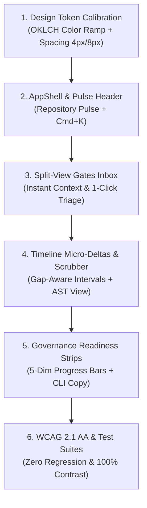

# Amber Protocol Web Viewer — Impeccable & Taste v10 Upgrade Specification (Refined)

**Project**: Amber Protocol Web Viewer (`Bandersnatch0x/amber-protocol`)  
**Stitch Project ID**: `13148335678122809815`  
**Stitch URL**: `https://stitch.withgoogle.com/projects/13148335678122809815?pli=1`  
**Date**: 2026-08-27  
**Scope**: Full Web Application (`apps/web/src/routes`, `apps/web/src/components`, `apps/web/src/features`)  
**Status**: Subagent Reviewed & Refined (Score: 9.3/10 — Ready for Implementation)

---

## 1. Executive Summary & Design North Star

Amber Protocol Web Viewer is a **repository-local developer command surface** for monitoring and governing autonomous agent coding sessions. It embodies the character of a **high-precision aircraft cockpit**:
- **Data First**: Every pixel delivers critical state; zero SaaS marketing fluff or decorative hero banners.
- **Tonal Depth**: Layering through surface tones (`steel-fog #f8fafc` -> `steel-white #ffffff` -> `steel-wash #f1f5f9`) rather than heavy drop shadows.
- **The Single Accent Rule**: Debug Blue (`#2563eb`) is strictly confined to ≤10% of screen area for primary intent and active selection.
- **Semantic Purity**: Emerald (Success/Pass), Amber (Warning/Pending Gate), Crimson (Error/Abort/Failure) are strictly functional.
- **Developer-Native Ergonomics**: Keyboard-first traversal (`J/K`, `Cmd+K`), split-view gate triage, granular timeline duration deltas (`+180ms`), and interactive AST JSON exploration.

---

## 2. Comprehensive Shortcomings Analysis (Current State)

### 2.1 App Shell & Global Navigation (`__root.tsx`)
- **Flat Header Context**: Top navbar lacks active repository pulse indication (live session count, pending gates, governance score).
- **Navigation Density**: Nav items lack keyboard shortcut hints (`1` for Sessions, `2` for Transcripts, `3` for Routes, `4` for Gates, `5` for Governance).
- **Mobile Drawer Transitions**: On narrow screens, the secondary scrollbar can be missed by users.

### 2.2 Home / Repository Control Surface (`/`)
- **Card Hierarchy Overload**: Status, Quick Actions, Lifecycle Stages, and Evidence Artifacts share identical 1px border card styling, diluting the visual anchor.
- **Passive Next Actions**: Next action recommendations are presented as static text rather than actionable 1-click jump links.
- **Lifecycle Diagram**: The 6-stage lifecycle (`Audit -> Init -> Plan -> Gate -> Verify -> Handoff`) is static and disconnected from real-time agent blockers.

### 2.3 Sessions Index & Detail (`/sessions`, `/sessions/$id`)
- **List Scanning on Wide Screens**: Excessive whitespace on 1440px+ displays with no compact table/row density toggle.
- **Manifest Inspection Friction**: Collapsed manifest displays raw JSON string in a `<pre>` tag rather than an interactive, searchable key-value tree viewer.
- **Live SSE Status Feedback**: Reconnecting and connection error states lack an inline retry trigger and clear time-since-last-heartbeat readout.

### 2.4 Event Timeline (`/sessions/$id/timeline`)
- **Missing Micro-Deltas**: Intervals between events are not visually computed with readable sub-second deltas (`+120ms`, `+2.4s`).
- **Tool-Call Categorization**: Tool events (Bash, Read, Write, Web, Gate) share generic blue tags without clear categorization glyphs.
- **Timeline Minimap**: Sessions with >50 events require extensive vertical scrolling without a scrubbable minimap rail.

### 2.5 Approval Gates Inbox (`/gates`)
- **Lack of Side-by-Side Split View**: Triaging a gate requires clicking review, expanding inline cards, or navigating away to read evidence, breaking operator flow.
- **Missing In-Situ Diff Preview**: When a gate is triggered by an artifact or plan mutation, the underlying diff is not rendered alongside the decision panel.

### 2.6 Governance Surface (`/governance`)
- **Metric Gauges**: Score breakdown is plain text rather than crisp high-density progress bars.
- **Remediation CLI Affordance**: Remediation recommendations lack 1-click copyable Amber CLI commands (`amber memory approve`, `amber context refresh`).

---

## 3. Impeccable & Taste Transformation Roadmap (With Subagent Refinements)

### 3.1 Design Tokens & Aesthetics (Taste)
- **Palette**: Strict adherence to Steel Fog (`#f8fafc` / `#0b0f17`), Steel White (`#ffffff` / `#1e293b`), Steel Line (`#e2e8f0` / `#334155`), and Debug Blue (`#2563eb`).
- **Typography**: Inter for UI prose (weights 400, 500, 600) + JetBrains Mono for identifiers, timestamps, and JSON data.
- **Spatial Rhythm**: 4px baseline grid, 6px border radius on inputs/buttons (`rounded-md`), 8px on cards (`rounded-lg`), 1px hairline borders.

### 3.2 Key Functional Upgrades (Impeccable & Refined)
1. **Repository Pulse Header (3-State Compact Pill)**: Top bar includes a quiet single-line capsule `[ ● 2 Active | 1 Gate | Score: 96 ]`. In normal state, it stays slate/gray; only wakes up with Amber/Crimson when there are pending gates or governance blocks.
2. **Split-View Gates Inbox with Strict Governance Boundaries**:
   - Master-Detail layout: Left list, right full inspection panel with audit evidence & diff.
   - Hotkeys: `J/K` navigation, `⌘+↵` to approve, `⌘+⇧+↵` to reject with reason.
   - **Governance Hard Rule**: High-risk `user-approval` gates MUST be inspected individually and bound to a valid Reviewer ID.
3. **Timeline Precision Scrubber with Chronology-Gap Awareness**:
   - Computes deltas against the full event stream: `+120ms` / `+2.4s` for fast tool executions; automatically shifts to `+14m 20s` with a dashed break indicator for human review pauses (>60s).
   - Tool classification icons: Terminal (Bash), Disk (File read/write), Network (Web/API), Lock (Gate).
4. **Interactive AST / JSON Inspector**: Searchable, collapsible key-value tree with copy-path and copy-value support, replacing plain `<pre>` dumps.
5. **Governance Readiness Strips & Health Bars**: High-density 5-dimension linear progress bars (Governance, Evidence, Continuity, Safety, Maintenance) paired with 1-click copyable CLI remediation blocks (`CommandCopyBlock`).
6. **Global Command Palette (`Cmd+K`)**: Rapid navigation across sessions, gates, routes, transcripts, and governance surfaces.

---

## 4. Stitch Integration Specifications (Project ID: `13148335678122809815`)

- **Design System Path**: `.stitch/DESIGN.md` (owns color ramps, typography hierarchy, component radius).
- **Per-Screen Prompts**: `.stitch/screen-prompts.md` (owns layout hierarchy, state handling, mobile collapse).
- **Screens Covered**:
  1. `01 - Home / Repository Control Surface` (`/`)
  2. `02 - Sessions List` (`/sessions`)
  3. `03 - Session Detail` (`/sessions/$id`)
  4. `04 - Session Timeline` (`/sessions/$id/timeline`)
  5. `05 - Routes List` (`/routes`)
  6. `06 - Route Detail` (`/routes/$id`)
  7. `07 - Gates` (`/gates`)
  8. `08 - Transcripts List` (`/transcripts`)
  9. `09 - Transcript Detail` (`/transcripts/$id`)
  10. `10 - Settings` (`/settings`)
