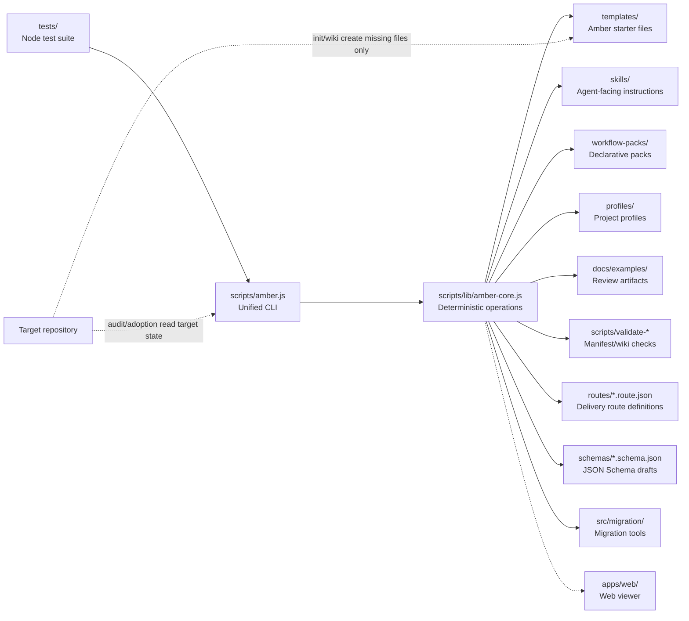

# Amber Protocol

<p align="center">
  
</p>

[简体中文](./README.zh-CN.md)


**Status:** Stable | **Version:** 1.0.0

Amber Protocol is a repo-local AI coding governance console for engineering teams. It helps teams prepare, review, verify, hand off, and audit AI-assisted coding work inside a repository.

## 📦 Installation

### From npm (Recommended)
```bash
npm install -g amber-protocol
amber --version
```

### From source
```bash
git clone https://github.com/Bandersnatch0x/amber-protocol.git
cd amber-protocol
npm install
node scripts/amber.js --version
```

## 🚀 Quick Start

### CLI Tools
```bash
node scripts/amber.js init --target path/to/repo
node scripts/amber.js audit --target path/to/repo
```

### Web Viewer
```bash
cd apps/web
npm install --legacy-peer-deps
npm run dev
# Visit http://localhost:3001
```

See [docs/DEPLOYMENT.md](./docs/DEPLOYMENT.md) for the deployment guide.

## ✅ Current Status

- **Core commands:** Repository onboarding, adoption review, governance surfaces — implemented and tested
- **Route engine:** Goal-driven workflow selection and execution — implemented and tested
- **Session lifecycle:** State machine, checkpoints, autonomous mode — implemented and tested
- **Web viewer:** Vite + React dashboard with session visualization — implemented; unit-tested, Playwright e2e specs wired into CI
- **Production hardening:** SSE token auth, loopback-only bind, error monitoring, graceful shutdown — implemented and tested

Run `npm test` (root suite) and `cd apps/web && npm test` (web suite) for current counts.

The current product is deliberately conservative. It creates review artifacts, dry-run plans, approval records, workflow-pack metadata, and maintenance proposals. It does not run Dynamic Workflows, invoke live subagents, execute target project commands, or automatically rewrite old project files.

Legacy `coding-harness` entrypoints remain compatibility shims, but new documentation and commands should lead with `amber` and Amber Protocol terminology.


## Positioning

This project is strongest when framed as a governance-first protocol layer with supporting verification and lifecycle capabilities. A useful way to read the current system is through seven control layers: `Execution`, `Tooling`, `Context`, `Lifecycle`, `Observability`, `Verification`, and `Governance`.

| Layer | Current role in this project | Priority |
| --- | --- | --- |
| `Execution` | Minimal. The project avoids becoming a general execution runtime or live agent platform. | Low |
| `Tooling` | CLI commands, schemas, validators, workflow packs, and profiles expose explicit interfaces. | Medium |
| `Context` | Starter docs, wiki scaffolds, manifests, and handoff artifacts keep project context explicit. | Medium |
| `Lifecycle` | Routes, sessions, checkpoints, worktrees, and continuation flows organize work locally. | Medium |
| `Observability` | Timelines, manifests, ledgers, reports, and maintenance artifacts make behavior inspectable. | High |
| `Verification` | Doctor, audit, validation, review, and gate surfaces provide explicit checks. | High |
| `Governance` | Approval records, safe defaults, policy boundaries, and adoption controls constrain behavior. | Highest |

This is the architectural through-line behind the Amber Protocol direction: strengthen `Governance`, `Verification`, and `Observability`; keep `Lifecycle` repository-local; avoid drifting into a full agent platform.

## Service packages

The commands below are organized into five service packages. Each package is a documentation grouping over existing real CLI commands, not a command namespace of its own.

| Service package | Start here | Outcome |
| --- | --- | --- |
| Repository Onboarding | `node scripts/amber.js doctor --target .` | Confirm the repo has agent-facing rules, wiki, feature state, handoff, and verification surfaces. |
| Adoption Review | `node scripts/amber.js adoption report --target . --output-dir docs/examples/adoptions` | Produce read-only readiness evidence before changing an existing repo. |
| Governed Delivery | `node scripts/amber.js plan --target . --feature F001 --title "Small slice"` | Move one task through plan, gate, review, accept, and completion evidence. |
| Continuity Layer | `node scripts/amber.js session start --goal "fix login bug"` | Start or resume work with session, checkpoint, timeline, and continuity-surface references. |
| Security Governance | `node scripts/amber.js security audit --target . --output docs/examples/security-audit.md` | Review dependency, secret, permission, and secure-review evidence. |

These are the real CLI commands; the "Service package" column is a documentation grouping, not a command namespace.

## Architecture

Amber Protocol is organized into clear architectural layers and domain modules.

### System Layers



### Core Boundaries

- `scripts/amber.js` handles command routing and user-facing output
- `scripts/lib/amber-core.js` contains deterministic scaffold, audit, adoption, planning, review, team, and maintenance logic
- `templates/`, `skills/`, `workflow-packs/`, and `profiles/` are declarative inputs
- `tests/` protect idempotency, output safety, schema validation, and boundaries
- `docs/examples/` contains review artifacts generated from real read-only trials

### Control Layers

| Layer | Current role | Priority |
| --- | --- | --- |
| `Execution` | Minimal. Avoids becoming a general execution runtime or live agent platform. | Low |
| `Tooling` | CLI commands, schemas, validators, workflow packs, and profiles expose explicit interfaces. | Medium |
| `Context` | Starter docs, wiki scaffolds, manifests, and handoff artifacts keep project context explicit. | Medium |
| `Lifecycle` | Routes, sessions, checkpoints, worktrees, and continuation flows organize work locally. | Medium |
| `Observability` | Timelines, manifests, ledgers, reports, and maintenance artifacts make behavior inspectable. | High |
| `Verification` | Doctor, audit, validation, review, and gate surfaces provide explicit checks. | High |
| `Governance` | Approval records, safe defaults, policy boundaries, and adoption controls constrain behavior. | Highest |

This is the architectural through-line: strengthen `Governance`, `Verification`, and `Observability`; keep `Lifecycle` repository-local; avoid drifting into a full agent platform.

### Key Architectural Components

For detailed architecture documentation, see:

- [Route Engine](./docs/architecture/route-engine.md) - Goal-driven workflow selection and execution
- [Session Lifecycle](./docs/architecture/session-lifecycle.md) - State management, checkpoints, autonomous mode
- [Web Viewer](./docs/architecture/web-viewer.md) - Dashboard visualization and real-time updates
- [Governance Model](./docs/architecture/governance-model.md) - Policy, evidence, audit trails

## Command Surface

### Core Commands

Safe bootstrap:

```sh
node scripts/amber.js init --target path/to/project
node scripts/amber.js audit --target path/to/project --summary
node scripts/amber.js wiki --target path/to/project --dry-run
node scripts/amber.js doctor --target path/to/project
node scripts/amber.js handoff --target path/to/project
```

Route engine:

```sh
node scripts/amber.js route list
node scripts/amber.js route inspect feature-standard
node scripts/amber.js route validate routes/feature-standard.route.json
node scripts/amber.js route test bugfix-quick --dry-run
```

Session lifecycle:

```sh
node scripts/amber.js session start --goal "fix login bug"
node scripts/amber.js session start --goal "add feature" --mode interactive
node scripts/amber.js session status
node scripts/amber.js session list
node scripts/amber.js session abort <session-id>
node scripts/amber.js session continue
```

Migration:

```sh
node scripts/amber.js migrate --target .
node scripts/amber.js migrate --target . --dry-run
```

Daemon:

```sh
node scripts/amber.js daemon status
node scripts/amber.js daemon stop
```

Adoption review chain:

```sh
node scripts/amber.js adoption report --target path/to/project --output-dir docs/examples/adoptions
node scripts/amber.js adoption index --reports-dir docs/examples/adoptions --output docs/examples/adoptions-index.md
node scripts/amber.js adoption validate --reports-dir docs/examples/adoptions --index docs/examples/adoptions-index.md
node scripts/amber.js adoption compare --reports-dir docs/examples/adoptions
node scripts/amber.js adoption gate --reports-dir docs/examples/adoptions
node scripts/amber.js adoption status --reports-dir docs/examples/adoptions --index docs/examples/adoptions-index.md
node scripts/amber.js adoption bundle --reports-dir docs/examples/adoptions --index docs/examples/adoptions-index.md --output-dir docs/examples/project-adoption-bundle
node scripts/amber.js adoption next-actions --bundle-dir docs/examples/project-adoption-bundle --output docs/examples/project-adoption-next-actions.md
node scripts/amber.js adoption decision-record --bundle-dir docs/examples/project-adoption-bundle --output docs/examples/project-adoption-decision-record.md
node scripts/amber.js adoption apply-plan --bundle-dir docs/examples/project-adoption-bundle --output docs/examples/project-adoption-apply-plan.md --dry-run
node scripts/amber.js adoption selected-files --bundle-dir docs/examples/project-adoption-bundle --output docs/examples/project-adoption-selected-files.md --include AGENTS.md
```

Artifact-only planning and review:

```sh
node scripts/amber.js plan --target path/to/project --feature F001 --title "Small slice"
node scripts/amber.js gate --target path/to/project --plan docs/plans/F001-small-slice.md
node scripts/amber.js review --target path/to/project --plan docs/plans/F001-small-slice.md
node scripts/amber.js accept --target path/to/project --plan docs/plans/F001-small-slice.md
```

Declarative inspection:

```sh
node scripts/amber.js pack inspect --file workflow-packs/safe-amber-bootstrap.pack.json
node scripts/amber.js pack validate --file workflow-packs/safe-amber-bootstrap.pack.json
node scripts/amber.js profile inspect --file profiles/default.profile.json
```

Local team and maintenance metadata:

```sh
node scripts/amber.js team inspect --target path/to/project
node scripts/amber.js team install --target path/to/project --version 1.0.0 --preset safe-bootstrap
node scripts/amber.js maintenance inspect --target path/to/project
node scripts/amber.js maintenance propose --target path/to/project
```

Governance surfaces:

```sh
node scripts/amber.js governance docs --target path/to/project
node scripts/amber.js governance policy --target path/to/project
node scripts/amber.js governance evidence --session <id> --output evidence.md
node scripts/amber.js governance audit --target path/to/project --output audit.md
```

Execution boundary validation (declarative, no execution):

```sh
node scripts/amber.js execution validate-integration --contract path/to/contract.json
node scripts/amber.js execution readiness --target path/to/project --plan docs/plans/F001-small-slice.md
```

Security audit:

```sh
node scripts/amber.js security audit --target path/to/project
```

Run `node scripts/amber.js <command> --help` for scoped command help.

Additional commands `task`, `result`, `agent`, and `loop` exist but are
lower-level orchestration tools used internally by the execution engine;
they are not documented in this README.

## What Gets Installed

Minimum Amber files checked by `doctor`:

- `AGENTS.md` and `CLAUDE.md`
- `feature_list.json`
- `PROGRESS.md`
- `session-handoff.md`
- `clean-state-checklist.md`
- `evaluator-rubric.md`
- `.workflow/continuous-improvement/state.json`
- minimum `docs/wiki/` pages for project context, system map, runbook, verification, glossary, and agent operations

Starter files are safe defaults. `init` and `wiki` skip existing files and report what would be created in dry-run mode.

## Adoption Boundaries

Adoption commands are for old or existing projects that should not be modified automatically.

- `adoption report` aggregates audit and dry-run evidence into a single review artifact.
- `adoption bundle` packages report status, index, diff, gate, and manifest files into a review directory.
- `adoption next-actions` creates a checklist for human approval.
- `adoption decision-record` records Gate A/B/C decisions but does not execute them.
- `adoption apply-plan --dry-run` previews bootstrap file creation; non-dry-run apply plans are rejected in V1.
- `adoption selected-files` accepts only safe relative known Amber file paths and writes only the requested proposal.

Sample adoption artifacts live under `docs/examples/` and are review-only. They do not imply the target project was initialized, modified, or tested.

## Development Roadmap

| Milestone | Status | Scope |
| --- | --- | --- |
| Core Bootstrap | Implemented | `init`, `audit`, `wiki`, `doctor`, `handoff` |
| Planning & Review | Implemented | Plans, gates, reviews, packs, teams, maintenance |
| Route Engine | Implemented | Schema foundation, route loader, selector, CLI commands |
| Session Lifecycle | Implemented | State machine, worktree manager, interactive execution |
| Checkpoints & Migration | Implemented | Checkpoint manager, state migration tools |
| Autonomous Mode | Implemented | Executor, policy, daemon, logger, notifier, session-lock |
| Integration Testing | Implemented | E2E, load, migration, security test suites |
| Web Viewer | Implemented | Vite + React + TanStack Router; unit + E2E tested |
| Production Hardening | Implemented | SSE auth, loopback bind, error monitoring, graceful shutdown |
| Loop Scheduling | Not implemented | Future-only readiness track |

Loop readiness is available as a static, record-only surface. `pack readiness` checks declarative controls without running jobs, dispatching live agents, writing external systems, or opening PRs. `loop inspect`, `loop run --dry-run`, `loop record`, and `loop status` resolve contracts and write or inspect ledger records only; `readyForLiveScheduling` remains `false` by product boundary.

For the full boundary notes, see [SPEC.md](./SPEC.md) and [ROADMAP.md](./ROADMAP.md).

## CI/CD

GitHub Actions lives in `.github/workflows/ci.yml`.

CI runs on pushes and pull requests:

- install dependencies with `npm install`
- run `npm test`
- run manifest validation
- run `doctor --target .`
- run `npm run gen:agents:check` to ensure generated platform commands have not drifted
- smoke-check CLI help with `node scripts/amber.js --help`
- build, unit-test, and e2e-test the web viewer in `apps/web` (Node 20.x, Playwright)

Release workflow automatically publishes to npm when a stable version tag (e.g., `v1.0.0`) is pushed:

- depends on all quality gates (test, web, coverage, security, performance)
- validates package contents before publishing
- publishes to npm using `NPM_TOKEN` secret
- creates GitHub Release with installation instructions

Release dry-run runs for pre-release tags (`-rc`, `-beta`) to test the workflow without publishing.

## Local Verification

```sh
npm test
npm run manifests
npm run doctor
node scripts/amber.js --help
```

The test suite uses Node's built-in test runner and requires Node `>=18.17`.

Load and E2E tests (separate, may be slower):

```sh
npm run test:load
```

## Non-Goals

- No Dynamic Workflow execution.
- No live subagent runner invocation.
- No automatic target project command execution.
- No external marketplace publishing.
- No automatic rewrite of existing target project docs.
- No scheduled loop execution in the current product.

---

## 🤝 Contributing

See [CONTRIBUTING.md](./CONTRIBUTING.md) for development setup, release process, and contribution guidelines.

## 💬 Support

- 📖 Documentation: [docs/](./docs/)
- 🐛 Report bugs: [GitHub Issues](https://github.com/Bandersnatch0x/amber-protocol/issues)
- 💡 Feature requests: [GitHub Discussions](https://github.com/Bandersnatch0x/amber-protocol/discussions)

## 📄 License

MIT License - see [LICENSE](./LICENSE) for details.

---

**Amber Protocol** - Repository-local AI coding governance for engineering teams.
