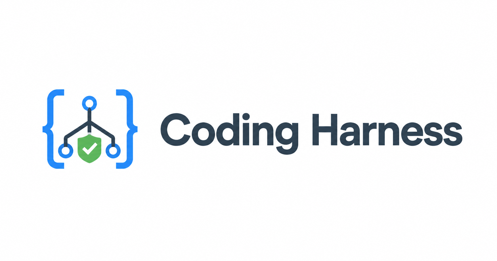
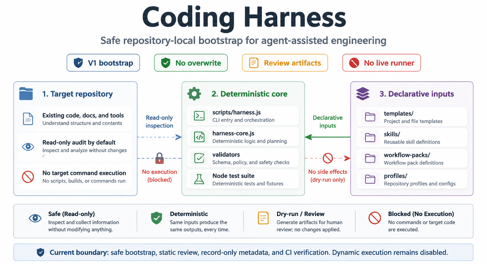
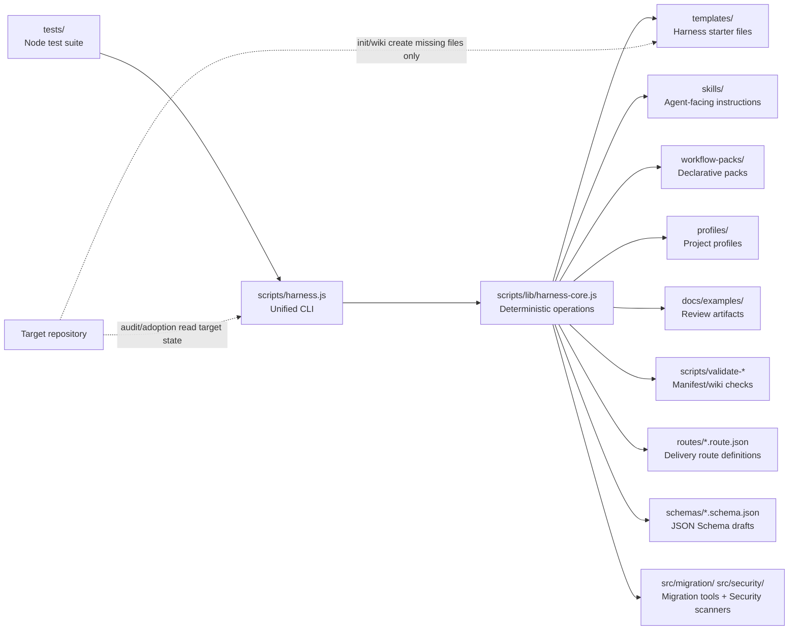

# Coding Harness

[简体中文](./README.zh-CN.md)



Coding Harness is a repository-local operating kit for agent-assisted engineering. It installs, audits, validates, and maintains a small set of files that help agents understand a project, keep feature state explicit, and hand off work cleanly.

The current product is deliberately conservative. It creates review artifacts, dry-run plans, approval records, workflow-pack metadata, and maintenance proposals. It does not run Dynamic Workflows, invoke live subagents, execute target project commands, or automatically rewrite old project files.



## Architecture



Core boundaries:

- `scripts/harness.js` handles command routing and user-facing output.
- `scripts/lib/harness-core.js` contains deterministic scaffold, audit, adoption, planning, review, team, and maintenance logic.
- `templates/`, `skills/`, `workflow-packs/`, and `profiles/` are declarative inputs.
- `tests/` protect idempotency, output safety, schema validation, and V1 boundaries.
- `docs/examples/` contains review artifacts generated from real read-only trials.

## Command Surface

### V1–V5.5 Commands

Safe bootstrap:

```sh
node scripts/harness.js init --target path/to/project
node scripts/harness.js audit --target path/to/project --summary
node scripts/harness.js wiki --target path/to/project --dry-run
node scripts/harness.js doctor --target path/to/project
node scripts/harness.js handoff --target path/to/project
```

### Phase B Commands

Route engine:

```sh
node scripts/harness.js route list
node scripts/harness.js route inspect feature-standard
node scripts/harness.js route validate routes/feature-standard.route.json
node scripts/harness.js route test bugfix-quick --dry-run
```

Session lifecycle:

```sh
node scripts/harness.js session start --goal "fix login bug"
node scripts/harness.js session start --goal "add feature" --mode interactive
node scripts/harness.js session status
node scripts/harness.js session list
node scripts/harness.js session abort <session-id>
node scripts/harness.js session continue
```

Migration:

```sh
node scripts/harness.js migrate --target .
node scripts/harness.js migrate --target . --dry-run
```

Daemon:

```sh
node scripts/harness.js daemon status
node scripts/harness.js daemon stop
```

Adoption review chain:

```sh
node scripts/harness.js adoption report --target path/to/project --output-dir docs/examples/adoptions
node scripts/harness.js adoption index --reports-dir docs/examples/adoptions --output docs/examples/adoptions-index.md
node scripts/harness.js adoption validate --reports-dir docs/examples/adoptions --index docs/examples/adoptions-index.md
node scripts/harness.js adoption compare --reports-dir docs/examples/adoptions
node scripts/harness.js adoption gate --reports-dir docs/examples/adoptions
node scripts/harness.js adoption status --reports-dir docs/examples/adoptions --index docs/examples/adoptions-index.md
node scripts/harness.js adoption bundle --reports-dir docs/examples/adoptions --index docs/examples/adoptions-index.md --output-dir docs/examples/project-adoption-bundle
node scripts/harness.js adoption next-actions --bundle-dir docs/examples/project-adoption-bundle --output docs/examples/project-adoption-next-actions.md
node scripts/harness.js adoption decision-record --bundle-dir docs/examples/project-adoption-bundle --output docs/examples/project-adoption-decision-record.md
node scripts/harness.js adoption apply-plan --bundle-dir docs/examples/project-adoption-bundle --output docs/examples/project-adoption-apply-plan.md --dry-run
node scripts/harness.js adoption selected-files --bundle-dir docs/examples/project-adoption-bundle --output docs/examples/project-adoption-selected-files.md --include AGENTS.md
```

Artifact-only planning and review:

```sh
node scripts/harness.js plan --target path/to/project --feature F001 --title "Small slice"
node scripts/harness.js gate --target path/to/project --plan docs/plans/F001-small-slice.md
node scripts/harness.js review --target path/to/project --plan docs/plans/F001-small-slice.md
node scripts/harness.js accept --target path/to/project --plan docs/plans/F001-small-slice.md
```

Declarative inspection:

```sh
node scripts/harness.js pack inspect --file workflow-packs/safe-harness-bootstrap.pack.json
node scripts/harness.js pack validate --file workflow-packs/safe-harness-bootstrap.pack.json
node scripts/harness.js profile inspect --file profiles/default.profile.json
```

Local team and maintenance metadata:

```sh
node scripts/harness.js team inspect --target path/to/project
node scripts/harness.js team install --target path/to/project --version 1.0.0 --preset safe-bootstrap
node scripts/harness.js maintenance inspect --target path/to/project
node scripts/harness.js maintenance propose --target path/to/project
```

Run `node scripts/harness.js <command> --help` for scoped command help.

## What Gets Installed

Minimum Harness files checked by `doctor`:

- `AGENTS.md` and `CLAUDE.md`
- `feature_list.json`
- `PROGRESS.md`
- `session-handoff.md`
- `clean-state-checklist.md`
- `evaluator-rubric.md`
- `.workflow/continuous-improvement/state.json`
- minimum `docs/wiki/` pages for project context, system map, runbook, verification, glossary, and agent operations

Starter files are safe defaults. `init` and `wiki` skip existing files and report what would be created in dry-run mode.

## Adoption Boundaries

Adoption commands are for old or existing projects that should not be modified automatically.

- `adoption report` aggregates audit and dry-run evidence into a single review artifact.
- `adoption bundle` packages report status, index, diff, gate, and manifest files into a review directory.
- `adoption next-actions` creates a checklist for human approval.
- `adoption decision-record` records Gate A/B/C decisions but does not execute them.
- `adoption apply-plan --dry-run` previews bootstrap file creation; non-dry-run apply plans are rejected in V1.
- `adoption selected-files` accepts only safe relative known Harness file paths and writes only the requested proposal.

StockAgents example artifacts live under `docs/examples/` and are review-only. They do not imply the target project was initialized, modified, or tested.

## Short Roadmap

| Phase | Status | Scope |
| --- | --- | --- |
| V1 – V5.5 | Implemented | `init`, `audit`, `wiki`, `doctor`, `handoff`, plans, gates, reviews, packs, teams, maintenance, loops |
| **Phase B Alpha W1** | Implemented | Schema foundation: route/session timeline schemas + validators |
| **Phase B Alpha W2** | Implemented | Route engine: route-loader, route-selector, `route` CLI |
| **Phase B Alpha W3** | Implemented | Session lifecycle: state machine, worktree manager, `session` CLI |
| **Phase B Alpha W4** | Implemented | Interactive execution: stage executor, gate handler, budget tracker |
| **Phase B Alpha W5** | Implemented | Checkpoint & continue: checkpoint-manager, migrate CLI |
| **Phase B Beta** | Implemented | Autonomous mode: executor, policy, daemon, logger, notifier, session-lock |
| **Phase B RC** | Implemented | Integration testing: e2e/load/migration/security test suites |
| **Phase B GA** | Implemented | Release: publish/release scripts, migration tools (dry-run, rollback, schema-validator) |
| **Phase C** | Scaffold only | Web Viewer — 7 config files, 0 pages. Deferred. |
| Future Live Loop Scheduling | Not implemented | future-only readiness track |

Loop readiness is available as a static, record-only surface. `pack readiness` checks declarative controls without running jobs, dispatching live agents, writing external systems, or opening PRs. `loop inspect`, `loop run --dry-run`, `loop record`, and `loop status` resolve contracts and write or inspect ledger records only; `readyForLiveScheduling` remains `false` by product boundary.

For the full boundary and phase notes, see [SPEC.md](./SPEC.md) and [ROADMAP.md](./ROADMAP.md).

## CI/CD

GitHub Actions lives in `.github/workflows/ci.yml`.

CI runs on pushes and pull requests:

- install dependencies with `npm install`
- run `npm test`
- run manifest validation
- run `doctor --target .`
- smoke-check CLI help

Release dry-run runs when a tag like `v1.2.3` is pushed:

- reruns the CI checks
- runs `npm pack --dry-run`
- uploads the generated package preview as an artifact

No workflow publishes packages, creates releases, or uses repository secrets.

## Local Verification

```sh
npm test
npm run manifests
npm run doctor
node scripts/harness.js --help
```

The test suite uses Node's built-in test runner and requires Node `>=18.17`.

Load and E2E tests (separate, may be slower):

```sh
npm run test:load
```

## Non-Goals

- No Dynamic Workflow execution.
- No live subagent runner invocation.
- No automatic target project command execution.
- No external marketplace publishing.
- No automatic rewrite of existing target project docs.
- No scheduled loop execution in the current product.
