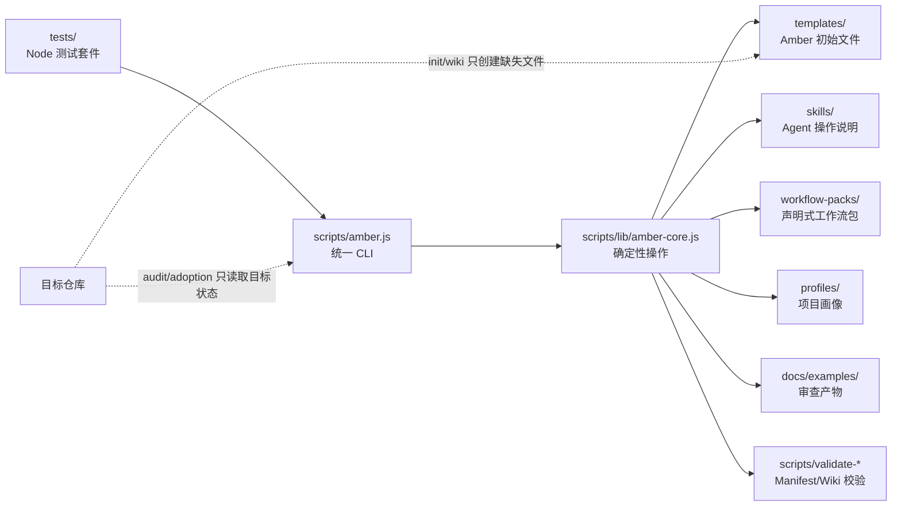

# Amber Protocol

<p align="center">
  
</p>

[English](./README.md)


**状态：** 发布候选版 | **版本：** 1.0.0-rc.1

Amber Protocol 是一个面向工程团队的仓库本地 AI 编码治理控制台。它帮助团队在仓库内准备、审查、验证、交接和审计由 AI 辅助的编码工作。

## 📦 安装

### 从 npm 安装（推荐）
```bash
npm install -g amber-protocol
amber --version
```

### 从源码安装
```bash
git clone https://github.com/Bandersnatch0x/amber-protocol.git
cd amber-protocol
npm install
node scripts/amber.js --version
```

## 🚀 快速开始

### CLI 工具
```bash
node scripts/amber.js init --target path/to/repo
node scripts/amber.js audit --target path/to/repo
```

### Web 查看器
```bash
cd apps/web
npm install --legacy-peer-deps
npm run dev
# 访问 http://localhost:3001
```

查看 [docs/DEPLOYMENT.md](./docs/DEPLOYMENT.md) 获取部署指南。

---

## 产品定位

当前产品刻意保持保守。它会创建审查产物、dry-run 计划、审批记录、workflow-pack 元数据和维护提案。它不会运行 Dynamic Workflow，不会调用真实 subagent，不会执行目标项目命令，也不会自动重写旧项目文件。


## 服务包

以下命令按照五个服务包进行组织。服务包是对现有真实 CLI 命令的文档分组，而不是独立的命令命名空间。

| 服务包 | 从这里开始 | 产出 |
| --- | --- | --- |
| Repository Onboarding | `node scripts/amber.js doctor --target .` | 确认仓库具备面向 Agent 的规则、Wiki、功能状态、交接和验证表面。 |
| Adoption Review | `node scripts/amber.js adoption report --target . --output-dir docs/examples/adoptions` | 在改动旧仓库之前生成只读的就绪度证据。 |
| Governed Delivery | `node scripts/amber.js plan --target . --feature F001 --title "Small slice"` | 让一个任务依次经过计划、闸门、审查、验收和完成度证据。 |
| Continuity Layer | `node scripts/amber.js session start --goal "fix login bug"` | 启动或恢复会话、检查点、时间线和连续性表面的工作。 |
| Security Governance | `node scripts/amber.js security audit --target . --output docs/examples/security-audit.md` | 审查依赖、密钥、权限和安全审查证据。 |

以上均为真实 CLI 命令；“服务包”列仅用于文档导航，不是命令命名空间。

## 架构



核心边界：

- `scripts/amber.js` 负责命令路由和面向用户的输出。
- `scripts/lib/amber-core.js` 包含确定性的 scaffold、audit、adoption、planning、review、team 和 maintenance 逻辑。
- `templates/`、`skills/`、`workflow-packs/`、`profiles/` 是声明式输入。
- `tests/` 保护幂等性、输出安全、schema 校验和 V1 边界。
- `docs/examples/` 保存来自真实只读试验的审查产物。

## 命令面

安全 bootstrap：

```sh
node scripts/amber.js init --target path/to/project
node scripts/amber.js audit --target path/to/project --summary
node scripts/amber.js wiki --target path/to/project --dry-run
node scripts/amber.js doctor --target path/to/project
node scripts/amber.js handoff --target path/to/project
```

Adoption 审查链：

```sh
node scripts/amber.js adoption report --target path/to/project --output-dir docs/examples/adoptions
node scripts/amber.js adoption index --reports-dir docs/examples/adoptions --output docs/examples/adoptions-index.md
node scripts/amber.js adoption validate --reports-dir docs/examples/adoptions --index docs/examples/adoptions-index.md
node scripts/amber.js adoption compare --reports-dir docs/examples/adoptions
node scripts/amber.js adoption gate --reports-dir docs/examples/adoptions
node scripts/amber.js adoption status --reports-dir docs/examples/adoptions --index docs/examples/adoptions-index.md
node scripts/amber.js adoption bundle --reports-dir docs/examples/adoptions --index docs/examples/adoptions-index.md --output-dir docs/examples/project-adoption-bundle
node scripts/amber.js adoption next-actions --bundle-dir docs/examples/project-adoption-bundle --output docs/examples/project-adoption-next-actions.md
node scripts/amber.js adoption decision-record --bundle-dir docs/examples/project-adoption-bundle --output docs/examples/project-adoption-decision-record.md
node scripts/amber.js adoption apply-plan --bundle-dir docs/examples/project-adoption-bundle --output docs/examples/project-adoption-apply-plan.md --dry-run
node scripts/amber.js adoption selected-files --bundle-dir docs/examples/project-adoption-bundle --output docs/examples/project-adoption-selected-files.md --include AGENTS.md
```

只生成产物的计划与审查：

```sh
node scripts/amber.js plan --target path/to/project --feature F001 --title "Small slice"
node scripts/amber.js gate --target path/to/project --plan docs/plans/F001-small-slice.md
node scripts/amber.js review --target path/to/project --plan docs/plans/F001-small-slice.md
node scripts/amber.js accept --target path/to/project --plan docs/plans/F001-small-slice.md
```

声明式检查：

```sh
node scripts/amber.js pack inspect --file workflow-packs/safe-amber-bootstrap.pack.json
node scripts/amber.js pack validate --file workflow-packs/safe-amber-bootstrap.pack.json
node scripts/amber.js profile inspect --file profiles/default.profile.json
```

本地 team 与 maintenance 元数据：

```sh
node scripts/amber.js team inspect --target path/to/project
node scripts/amber.js team install --target path/to/project --version 1.0.0 --preset safe-bootstrap
node scripts/amber.js maintenance inspect --target path/to/project
node scripts/amber.js maintenance propose --target path/to/project
```

运行 `node scripts/amber.js <command> --help` 查看具体命令帮助。

## 会安装什么

`doctor` 检查的最小 Amber 文件：

- `AGENTS.md` 和 `CLAUDE.md`
- `feature_list.json`
- `PROGRESS.md`
- `session-handoff.md`
- `clean-state-checklist.md`
- `evaluator-rubric.md`
- `.workflow/continuous-improvement/state.json`
- 最小 `docs/wiki/` 页面，用于项目上下文、系统图、runbook、验证、术语表和 Agent 操作

Starter 文件是安全默认值。`init` 和 `wiki` 会跳过已有文件，并在 dry-run 模式报告将创建的内容。

## Adoption 边界

Adoption 命令面向不应被自动修改的旧项目或既有项目。

- `adoption report` 把 audit 与 dry-run 证据聚合成一个审查产物。
- `adoption bundle` 把 report status、index、diff、gate 和 manifest 文件打包成审查目录。
- `adoption next-actions` 创建人工审批清单。
- `adoption decision-record` 记录 Gate A/B/C 决策，但不会执行决策。
- `adoption apply-plan --dry-run` 预览 bootstrap 文件创建；V1 拒绝非 dry-run apply plan。
- `adoption selected-files` 只接受安全的相对已知 Amber 文件路径，并且只写入指定的提案文件。

示例 adoption 产物位于 `docs/examples/`，仅用于审查。它们不表示目标项目已被初始化、修改或测试。

## 简版 Roadmap

| 阶段 | 状态 | 范围 |
| --- | --- | --- |
| V1 – V5.5 | 已实现 | `init`、`audit`、`wiki`、`doctor`、`handoff`、plans、gates、reviews、packs、teams、maintenance、loops |
| **Phase B Alpha W1** | 已实现 | Schema 基础：route/session timeline schemas + validators |
| **Phase B Alpha W2** | 已实现 | Route engine：route-loader、route-selector、`route` CLI |
| **Phase B Alpha W3** | 已实现 | Session lifecycle：state machine、worktree manager、`session` CLI |
| **Phase B Alpha W4** | 已实现 | Interactive execution：stage executor、gate handler、budget tracker |
| **Phase B Alpha W5** | 已实现 | Checkpoint & continue：checkpoint-manager、migrate CLI |
| **Phase B Beta** | 已实现 | Autonomous mode：executor、policy、daemon、logger、notifier、session-lock |
| **Phase B RC** | 已实现 | Integration testing：e2e/load/migration/security test suites |
| **Phase B GA** | 已实现 | Release：publish/release scripts、migration tools（dry-run、rollback、schema-validator） |
| **Phase C** | 已实现 | Web Viewer — Vite + React + TanStack Router；单元测试通过；Playwright e2e 已接入 CI |
| **Phase D** | 部分实现 | Production hardening — SSE auth helpers 与 error logging 已存在；SSE endpoint enforcement 与外部监控尚未接入 |
| Future Live Loop Scheduling | 未实现 | 仅保留未来 readiness 轨道；scheduled execution 仍禁用 |

完整边界和阶段说明见 [SPEC.md](./SPEC.md) 与 [ROADMAP.md](./ROADMAP.md)。

## CI/CD

GitHub Actions 位于 `.github/workflows/ci.yml`。

CI 在 push 和 pull request 上运行：

- 使用 `npm install` 安装依赖
- 运行 `npm test`
- 运行 manifest 校验
- 运行 `doctor --target .`
- 运行 `npm run gen:agents:check`，确保各平台生成的命令产物没有漂移
- 使用 `node scripts/amber.js --help` 做 CLI smoke-check
- 在 `apps/web` 中构建、单元测试并运行 Playwright e2e 测试（Node 20.x）

当推送类似 `v1.2.3` 的 tag 时，会运行 release dry-run：

- 依赖 `test` 和 `web` 两个 CI job
- 运行 `npm pack --dry-run`
- 上传生成的 package preview artifact

当前 workflow 不发布 package，不创建 GitHub Release，也不使用仓库 secrets。

## 本地验证

```sh
npm test
npm run manifests
npm run doctor
node scripts/amber.js --help
```

测试套件使用 Node 内置 test runner，需要 Node `>=18.17`。

## 非目标

- 不执行 Dynamic Workflow。
- 不调用真实 subagent runner。
- 不自动执行目标项目命令。
- 不发布到外部 marketplace。
- 不自动重写已有目标项目文档。
- 当前产品不执行 scheduled loop。

---

## 🤝 贡献

查看 [CONTRIBUTING.md](./CONTRIBUTING.md) 了解开发设置、发布流程和贡献指南。

## 💬 支持

- 📖 文档：[docs/](./docs/)
- 🐛 报告问题：[GitHub Issues](https://github.com/Bandersnatch0x/amber-protocol/issues)
- 💡 功能建议：[GitHub Discussions](https://github.com/Bandersnatch0x/amber-protocol/discussions)

## 📄 许可证

MIT License - 查看 [LICENSE](./LICENSE) 了解详情。

---

**Amber Protocol** - 为工程团队提供仓库本地 AI 编码治理。
