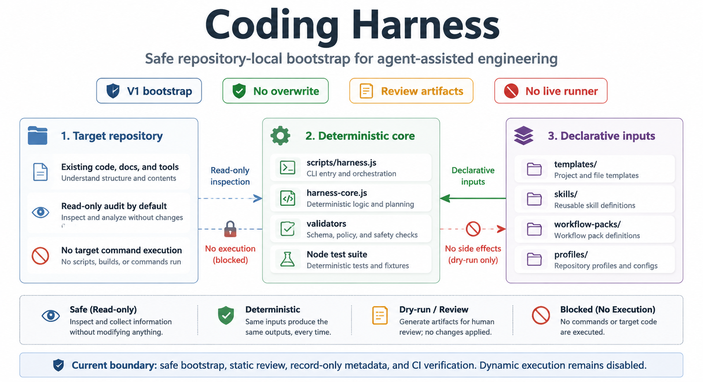
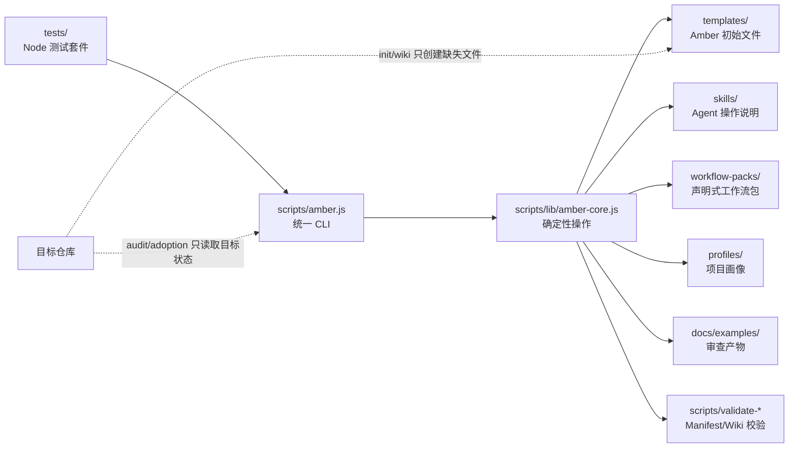

# Amber Protocol

[English](./README.md)


Amber Protocol（原 Coding Harness）是一个仓库本地的编码代理治理层（governance layer）。它用于安装、审计、验证和维护一组小而明确的项目文件，帮助 Agent 理解项目、显式记录功能状态，并在会话之间可靠交接。

当前产品刻意保持保守。它会创建审查产物、dry-run 计划、审批记录、workflow-pack 元数据和维护提案。它不会运行 Dynamic Workflow，不会调用真实 subagent，不会执行目标项目命令，也不会自动重写旧项目文件。



## 架构



核心边界：

- `scripts/amber.js` 负责命令路由和面向用户的输出。
- `scripts/lib/amber-core.js` 包含确定性的 scaffold、audit、adoption、planning、review、team 和 maintenance 逻辑。
- `templates/`、`skills/`、`workflow-packs/`、`profiles/` 是声明式输入。
- `tests/` 保护幂等性、输出安全、schema 校验和 V1 边界。
- `docs/examples/` 保存来自真实只读试验的审查产物。

## 命令面

安全 bootstrap：

```sh
node scripts/amber.js init --target path/to/project
node scripts/amber.js audit --target path/to/project --summary
node scripts/amber.js wiki --target path/to/project --dry-run
node scripts/amber.js doctor --target path/to/project
node scripts/amber.js handoff --target path/to/project
```

Adoption 审查链：

```sh
node scripts/amber.js adoption report --target path/to/project --output-dir docs/examples/adoptions
node scripts/amber.js adoption index --reports-dir docs/examples/adoptions --output docs/examples/adoptions-index.md
node scripts/amber.js adoption validate --reports-dir docs/examples/adoptions --index docs/examples/adoptions-index.md
node scripts/amber.js adoption compare --reports-dir docs/examples/adoptions
node scripts/amber.js adoption gate --reports-dir docs/examples/adoptions
node scripts/amber.js adoption status --reports-dir docs/examples/adoptions --index docs/examples/adoptions-index.md
node scripts/amber.js adoption bundle --reports-dir docs/examples/adoptions --index docs/examples/adoptions-index.md --output-dir docs/examples/project-adoption-bundle
node scripts/amber.js adoption next-actions --bundle-dir docs/examples/project-adoption-bundle --output docs/examples/project-adoption-next-actions.md
node scripts/amber.js adoption decision-record --bundle-dir docs/examples/project-adoption-bundle --output docs/examples/project-adoption-decision-record.md
node scripts/amber.js adoption apply-plan --bundle-dir docs/examples/project-adoption-bundle --output docs/examples/project-adoption-apply-plan.md --dry-run
node scripts/amber.js adoption selected-files --bundle-dir docs/examples/project-adoption-bundle --output docs/examples/project-adoption-selected-files.md --include AGENTS.md
```

只生成产物的计划与审查：

```sh
node scripts/amber.js plan --target path/to/project --feature F001 --title "Small slice"
node scripts/amber.js gate --target path/to/project --plan docs/plans/F001-small-slice.md
node scripts/amber.js review --target path/to/project --plan docs/plans/F001-small-slice.md
node scripts/amber.js accept --target path/to/project --plan docs/plans/F001-small-slice.md
```

声明式检查：

```sh
node scripts/amber.js pack inspect --file workflow-packs/safe-amber-bootstrap.pack.json
node scripts/amber.js pack validate --file workflow-packs/safe-amber-bootstrap.pack.json
node scripts/amber.js profile inspect --file profiles/default.profile.json
```

本地 team 与 maintenance 元数据：

```sh
node scripts/amber.js team inspect --target path/to/project
node scripts/amber.js team install --target path/to/project --version 1.0.0 --preset safe-bootstrap
node scripts/amber.js maintenance inspect --target path/to/project
node scripts/amber.js maintenance propose --target path/to/project
```

运行 `node scripts/amber.js <command> --help` 查看具体命令帮助。

## 会安装什么

`doctor` 检查的最小 Amber 文件：

- `AGENTS.md` 和 `CLAUDE.md`
- `feature_list.json`
- `PROGRESS.md`
- `session-handoff.md`
- `clean-state-checklist.md`
- `evaluator-rubric.md`
- `.workflow/continuous-improvement/state.json`
- 最小 `docs/wiki/` 页面，用于项目上下文、系统图、runbook、验证、术语表和 Agent 操作

Starter 文件是安全默认值。`init` 和 `wiki` 会跳过已有文件，并在 dry-run 模式报告将创建的内容。

## Adoption 边界

Adoption 命令面向不应被自动修改的旧项目或既有项目。

- `adoption report` 把 audit 与 dry-run 证据聚合成一个审查产物。
- `adoption bundle` 把 report status、index、diff、gate 和 manifest 文件打包成审查目录。
- `adoption next-actions` 创建人工审批清单。
- `adoption decision-record` 记录 Gate A/B/C 决策，但不会执行决策。
- `adoption apply-plan --dry-run` 预览 bootstrap 文件创建；V1 拒绝非 dry-run apply plan。
- `adoption selected-files` 只接受安全的相对已知 Amber 文件路径，并且只写入指定的提案文件。

StockAgents 示例产物位于 `docs/examples/`，仅用于审查。它们不表示目标项目已被初始化、修改或测试。

## 简版 Roadmap

| 阶段 | 状态 | 范围 |
| --- | --- | --- |
| V1 Safe Amber Bootstrap | 已实现 | `init`、`audit`、`wiki`、`doctor`、`handoff` |
| V1.5 Compatibility Hardening | 已实现 | 目标分类、有界摘要、manifest/wiki 校验 |
| V2 Planning Layer | 已实现 | 计划、人工 gate、source bundle、checkpoint 字段 |
| V2.5 Review And Acceptance | 已实现 | 静态审查、验收记录、回归提案 |
| V3 Workflow Pack Design Kit | 已实现 | 声明式 pack/profile 检查与校验 |
| V4 Isolated Execution Foundation | 已实现 | task ledger、evidence、replay artifact |
| V4.5 Agent Orchestration Records | 已实现 | dispatch/reviewer 记录，不执行 worker |
| V5 Team Distribution | 已实现 | 本地 registry、install/pin/update/rollback 元数据 |
| V5.5 Maintenance Proposals | 已实现 | stale docs、drift、wiki lint、可审查提案 |
| Future Live Loop Scheduling | 未实现 | 仅保留未来 readiness 轨道；scheduled execution 仍禁用 |

完整边界和阶段说明见 [SPEC.md](./SPEC.md) 与 [ROADMAP.md](./ROADMAP.md)。

## CI/CD

GitHub Actions 位于 `.github/workflows/ci.yml`。

CI 在 push 和 pull request 上运行：

- 使用 `npm install` 安装依赖
- 运行 `npm test`
- 运行 manifest 校验
- 运行 `doctor --target .`
- smoke-check CLI help

当推送类似 `v1.2.3` 的 tag 时，会运行 release dry-run：

- 依赖 CI 测试矩阵
- 运行 `npm pack --dry-run`
- 上传生成的 package preview artifact

当前 workflow 不发布 package，不创建 GitHub Release，也不使用仓库 secrets。

## 本地验证

```sh
npm test
npm run manifests
npm run doctor
node scripts/amber.js --help
```

测试套件使用 Node 内置 test runner，需要 Node `>=18.17`。

## 非目标

- 不执行 Dynamic Workflow。
- 不调用真实 subagent runner。
- 不自动执行目标项目命令。
- 不发布到外部 marketplace。
- 不自动重写已有目标项目文档。
- 当前产品不执行 scheduled loop。
