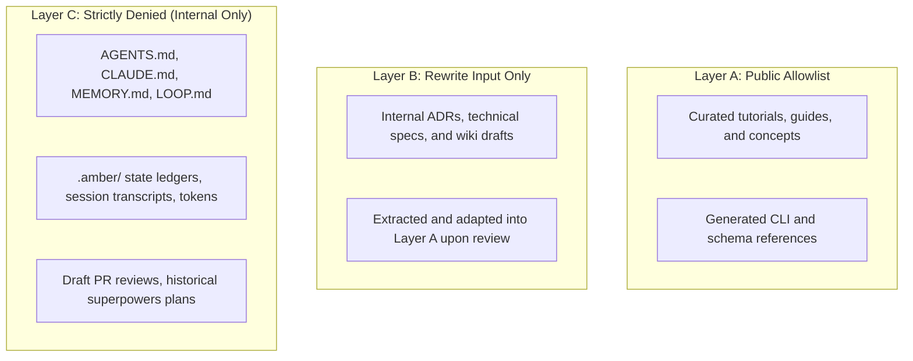

# Documentation Ownership & Contribution

Public documentation for Amber Protocol is governed by the same rigorous pull-request and code-ownership process as the core runtime.

## Code Ownership

- **Owner**: [`@Bandersnatch0x`](https://github.com/Bandersnatch0x) is the designated owner in `.github/CODEOWNERS` for `/apps/docs/`.
- **Review Route**: All pull requests modifying public documentation require review from repository owners prior to merging.

## Public Corpus Layering (A/B/C)

To prevent internal research notes, private tokens, or unreviewed drafts from entering the public site, content is governed by three strict layers:

- **Layer A (Public Allowlist)**: Content reviewed and explicitly added to `apps/docs/docs-manifest.json`. Only Layer A pages are built and indexed.
- **Layer B (Rewrite Input Only)**: Internal architectural records and wiki pages. Must be distilled and rewritten before entering public navigation.
- **Layer C (Strictly Denied)**: Internal governance files, active agent instructions, `.amber/` ledgers, and credentials. The build verification gate strictly fails if any Layer C file or link appears in build output.

## Hand-Written vs Generated Content

- **Generated Reference Pages** (`apps/docs/docs/reference/cli/*`): Generated automatically from `scripts/lib/command-registry.js`. Do not edit manually; submit changes to the registry and run `npm run docs:gen`.
- **Hand-Written Prose Pages** (`start-here/`, `concepts/`, `guides/`, `about/`, `troubleshooting/`): Authored directly as Markdown/MDX in `apps/docs/docs/`.
