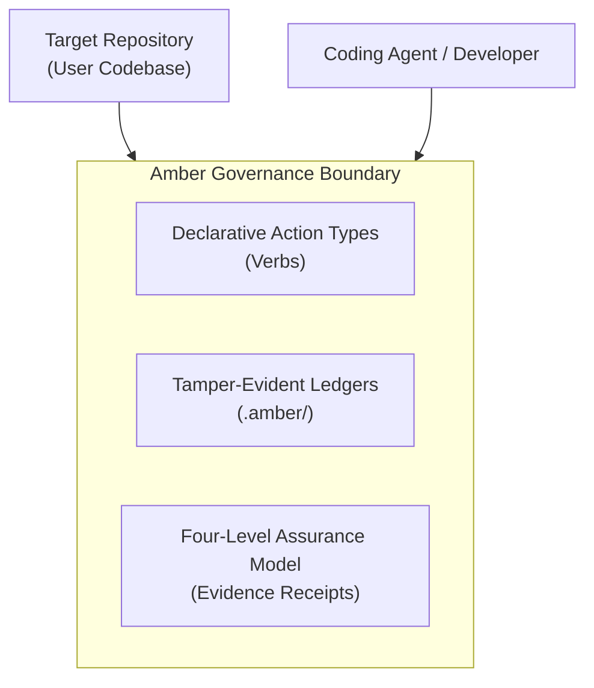

# Core Concepts Overview

Amber Protocol establishes a clear operational ontology for software engineering performed by or with AI coding agents.

Rather than letting agents execute arbitrary commands or modify unconstrained files across your system, Amber acts as a **governed boundary**.

## The Governance Model

Amber's architecture is built around three foundational pillars:

### 1. Verbs Over Objects
Amber exposes explicit verbs (Action Types like `session.start`, `evidence.record`, `gate.evaluate`, `handoff.bundle`) over the objects it manages. All operations validate against strict JSON schemas before execution.

### 2. Repository-Local Isolation
All governance state is scoped to a specific target repository via `--target <path>`. Amber stores state exclusively in the target repository's `.amber/` directory.

### 3. Four-Level Assurance Model
Claims made by agents or tools must be backed by verifiable receipts across four assurance tiers: `unavailable`, `observed`, `replayable`, and `verified`.

---

## Key Concepts

- [**Target Repository**](/concepts/target-repository) — The boundary and isolation rules governing Amber's access to user projects.
- [**Amber Setup & Directory**](/concepts/amber-setup) — The internal `.amber/` layout, rules, and idempotent scaffolding.
- [**Sessions & Timelines**](/concepts/session) — How sessions track lifecycle stages, checkpoints, and completion evidence.
- [**Routes & Stage Pipelines**](/concepts/route) — Predefined workflows (`feature-standard`, `bugfix-quick`, `refactor-safe`) and gate criteria.
- [**Structured Wiki**](/concepts/wiki) — Open Knowledge Format (OKF) docs, knowledge plans, and document distillation contracts.
- [**Evidence & Assurance**](/concepts/evidence) — Tamper-evident hash-chained evidence receipts and separation-of-duties verification.
- [**Public Glossary**](/concepts/glossary) — Authoritative dictionary of all Amber Protocol terms and concepts.
