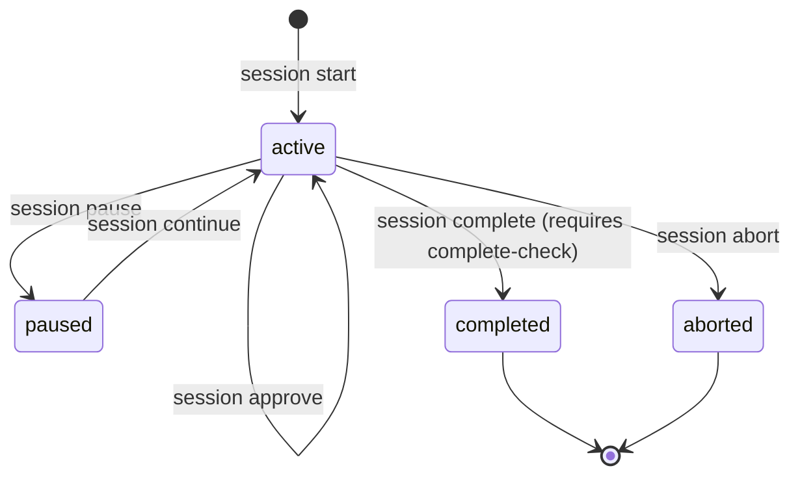

# Session Lifecycle & State Machine

A **Session** is an atomic, governed unit of engineering work in Amber Protocol. Every change, bug fix, or refactor executed by a developer or coding agent can be tracked through a session.

## State Machine

## Session Anatomy

Each session is identified by a unique ID (e.g. `2026-09-01-feat-user-auth-01`) and consists of:
1. `manifest.json`: Metadata defining the session goal, assigned route, initiator identity, budget, and worktree settings.
2. `timeline.jsonl`: An append-only log of events (`stage_entered`, `checkpoint_passed`, `evidence_recorded`, `gate_passed`, `completed`).

## Completion Gates

A session cannot be marked as `completed` until `amber session complete-check --session <id>` passes:
- All required route stages must have valid checkpoint entries.
- Required verification evidence must be recorded.
- Required human approval gates must be satisfied.
- In `--strict` mode, unverified claims fail the completion check.
