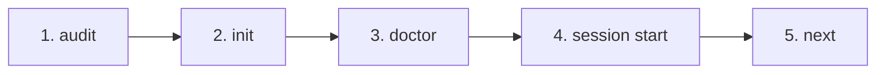

import CommandBlock from '@site/src/components/command-block';

# First Governed Workflow

The canonical adoption workflow follows a **read-only-first** discipline. Before writing any files or scaffolding, you inspect the repository, initialize starter files idempotently, verify setup health, begin a tracked session, and request deterministic route advice.

The 5-step sequence is:



---

## Step 1: Audit (Read-Only Inspection)

First, inspect your target repository to assess its structure, existing agent files, and readiness without making any changes.

<CommandBlock
  context="Target Repository"
  nature="read-only"
  command="amber audit --target . --summary"
  expectedSignal="Readiness score, detected agent rules, and missing governance files reported (0 files written)."
/>

---

## Step 2: Init (Idempotent Scaffolding)

Initialize missing Amber starter files (including `.amber/` configuration and starter templates). Existing files are never overwritten.

<CommandBlock
  context="Target Repository"
  nature="idempotent-write"
  command="amber init --target ."
  expectedSignal="Created .amber/ structure and starter files. Skipped existing user files."
/>

To preview what files would be created beforehand without touching disk, add `--dry-run`:

```bash
amber init --target . --dry-run
```

---

## Step 3: Doctor (Validate Amber Setup)

Run the Amber Doctor guardrail suite to verify that the scaffolding, schema rules, and target configuration are healthy and conformant.

<CommandBlock
  context="Target Repository"
  nature="read-only"
  command="amber doctor --target ."
  expectedSignal="✅ All Amber guardrail checks passed; 0 errors."
/>

---

## Step 4: Session Start (Begin Tracked Session)

Start a governed engineering session. Amber creates an immutable session record and timeline under `.amber/sessions/<session-id>/` to track lifecycle stages and evidence.

<CommandBlock
  context="Target Repository"
  nature="governed-write"
  command='amber session start --goal "Evaluate Amber Protocol governance" --target .'
  expectedSignal="Session initialized with ID <session-id>. Active timeline registered."
/>

---

## Step 5: Next (Deterministic Action Advice)

Query Amber's route engine for deterministic guidance on what to do next based on your session state and goal.

<CommandBlock
  context="Target Repository"
  nature="read-only"
  command="amber next --target ."
  expectedSignal="Recommended route stage and actionable command suggestions printed (no LLM decision)."
/>

---

## Success Criteria

You have successfully completed the first governed workflow when:
1. `amber doctor --target .` exits with code `0`.
2. A new session directory exists under `.amber/sessions/` with a valid `manifest.json` and `timeline.jsonl`.
3. You can verify that Amber operated without modifying any user source files outside `.amber/`.

Now explore the [Core Concepts](/concepts) or learn how to [Adopt Amber on an Existing Project](/guides/adopting-existing-project).
