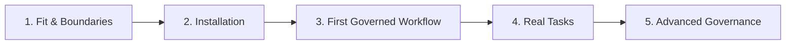

# Amber Protocol Overview & Boundaries

Amber Protocol is a **repository-local governance kit** for agent-assisted engineering. It provides an operational boundary around autonomous and pair-programming coding agents, ensuring that changes, evidence, decisions, and handoffs are verifiable, tamper-evident, and auditable.

```bash
amber <command> --target path/to/repo
```

## What Amber Is

- **Repository-Local**: All governance state, session tracking, evidence logs, and handoff bundles live inside the target repository under the `.amber/` directory. Amber requires no external server, daemon, or cloud subscription.
- **Governance-First**: Amber models development activity through structured, declarative verbs (Action Types) operating on auditable objects (Sessions, Routes, Wiki, Evidence, Decisions).
- **Read-Only by Default**: All Amber commands default to read-only inspection. Mutations require explicit flags or governed lifecycle transitions.
- **Idempotent & Tamper-Evident**: Governance ledgers use append-only cryptographic hashes to guarantee audit trail integrity.
- **Zero External Telemetry**: Amber documentation, CLI tools, and web viewers operate completely offline without sending telemetry, query tracking, or user behavior to third parties.

## What Amber Is NOT

To prevent misunderstandings about Amber's authority and scope, the safety boundaries are strictly defined:

- ❌ **NOT a Hosted Agent Runtime**: Amber does not run an agent server, cloud worker, or background service.
- ❌ **NO Autonomous Execution**: Amber does not automatically run tests, build pipelines, or execute target project code on your machine without explicit interactive command flags.
- ❌ **NO Remote Agent Dispatch**: Amber does not spawn remote LLMs or dispatch unmonitored background tasks.
- ❌ **NO Dynamic Code Rewriting**: Amber never silently modifies, deletes, or overwrites user project code without explicit confirmation.
- ❌ **NO Telemetry / Tracking**: Normal usage, search queries, and documentation browsing contain zero tracking scripts or outbound beacons.

## Adoption Journey

The recommended path for new teams and developers adopts a five-phase progression:



1. **Evaluate Fit & Boundaries** (this page) — Understand Amber's safety model and verify it matches your security posture.
2. [**Installation & Environment**](/start-here/installation) — Verify Node and npm requirements and install the CLI.
3. [**First Governed Workflow**](/start-here/first-governed-workflow) — Run the canonical 5-step lifecycle (`audit` → `init` → `doctor` → `session start` → `next`).
4. [**Task Guides**](/guides/adopting-existing-project) — Adopt Amber into your existing repositories and workflow pipelines.
5. [**Advanced Governance**](/concepts/evidence) — Leverage evidence receipts, policy evaluation, and tamper-evident ledgers.

Next, proceed to [Installation & Environment Requirements](/start-here/installation).
