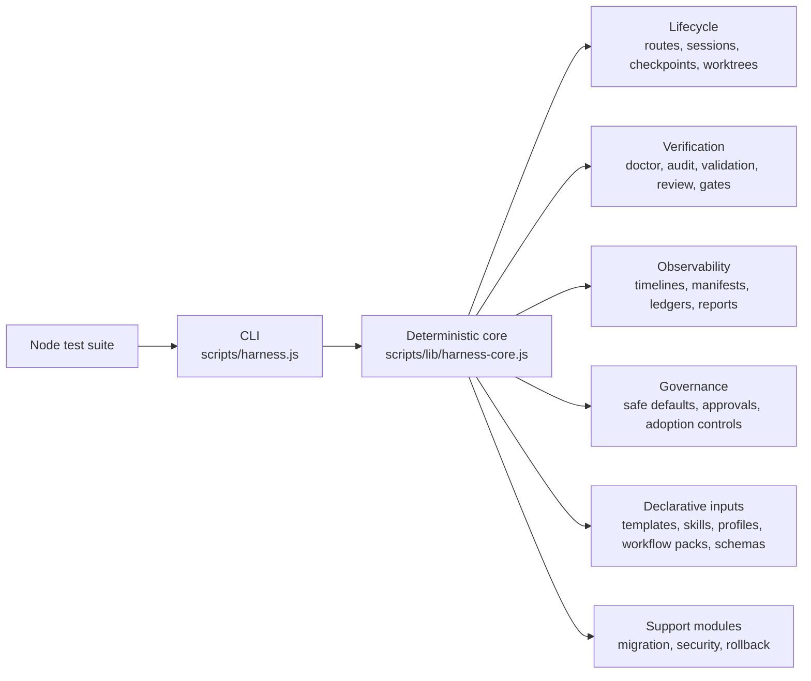

# System Architecture

High-level overview of the current `Coding Harness` repository and the architectural direction that is converging toward **Amber Protocol**.

## Positioning

The current repository and package names still use `Coding Harness`. Architecturally, the project is moving toward a clearer role: a repository-local governance layer for coding agents.

The system can be understood through seven internal control layers:

| Layer | Role in this repository |
| --- | --- |
| `Execution` | Intentionally narrow. The project avoids becoming a general-purpose agent runtime or live execution platform. |
| `Tooling` | CLI commands, schemas, validators, workflow packs, and profiles provide explicit interfaces. |
| `Context` | Starter docs, wiki scaffolds, manifests, and handoff files keep project context explicit. |
| `Lifecycle` | Routes, sessions, checkpoints, worktrees, and continuation flows organize work locally. |
| `Observability` | Timelines, manifests, ledgers, reports, and maintenance artifacts make actions inspectable. |
| `Verification` | Audit, doctor, validation, review, and gate surfaces provide explicit checks. |
| `Governance` | Safe defaults, approval records, policy boundaries, and adoption controls limit agent behavior. |

The practical emphasis is `Governance`, `Verification`, and `Observability`, with enough `Lifecycle` support to make those controls enforceable inside a repository.

## System Map

## Core Subsystems

### CLI and deterministic core

- `scripts/harness.js` handles command routing and user-facing output.
- `scripts/lib/harness-core.js` aggregates deterministic scaffold, audit, adoption, planning, review, team, and maintenance logic.
- The CLI is intentionally repository-local and artifact-first.

### Lifecycle layer

- Routes define delivery shapes and stage ordering.
- Sessions track state, manifests, timelines, and continuation behavior.
- Worktrees and checkpoints provide bounded execution state without turning the system into a general orchestration platform.

### Verification layer

- `doctor`, schema validation, route validation, reviews, and gates provide explicit checks.
- Adoption flows package read-only evidence into review artifacts before any apply step is considered.
- Verification is designed to be inspectable by both humans and agents.

### Observability layer

- Session timelines, manifests, ledgers, reports, and maintenance artifacts create a reviewable record of behavior.
- The project treats inspectable artifacts as first-class outputs, not incidental logs.

### Governance layer

- Safe defaults, dry-run boundaries, approval records, and adoption controls constrain what the system may do.
- Repository-local state and file-based artifacts make policy and handoff visible to reviewers.
- This is the layer that most clearly differentiates the project from a general agent framework.

### Declarative inputs and support infrastructure

- `templates/`, `skills/`, `workflow-packs/`, `profiles/`, `routes/`, and `schemas/` are declarative inputs.
- `src/migration/`, `src/security/`, and rollback utilities support compatibility, hardening, and recovery.

## Design Principles

1. **Least privilege**: permissions and write surfaces stay explicit.
2. **Idempotency**: repeated runs should stay safe and understandable.
3. **Governance first**: approval, auditability, and constraints matter more than raw automation breadth.
4. **Artifact-first verification**: plans, reports, timelines, and manifests are primary control surfaces.
5. **Safe by default**: dry-run and read-only adoption boundaries prevent accidental drift.

## Technology Stack

| Layer | Technology |
| --- | --- |
| Runtime | Node.js >= 18.17 |
| Language | JavaScript (CommonJS) |
| Package Manager | npm |
| Validation | AJV (JSON Schema) |
| Testing | Node.js built-in test runner |
| Formatting and linting | ESLint, Prettier |

See also: [Data Flow](./data-flow.md), [Extension Points](./extension-points.md)
