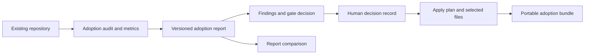

# Adoption System

Last Reviewed: 2026-08-08

The adoption system evaluates an existing repository and produces a reviewable path
for adopting Amber. It separates observation, proposal, human decision, gating, and
artifact packaging. The pipeline writes reports and plans; it does not silently apply
the proposed repository changes.

## Key Files

- `scripts/lib/core/adoption-reports.js` generates uniquely named reports, indexes and
  validates report sets, parses report metadata and metrics, and compares reports.
- `scripts/lib/core/adoption-metrics.js` builds the audit metrics block and provides a
  stable serialize/parse boundary for report comparisons.
- `scripts/lib/core/adoption-gate.js` converts report findings into a gate decision,
  status, and next action.
- `scripts/lib/core/adoption-proposals.js` writes decision records, apply plans, and
  selected-file manifests while enforcing safe selectable paths.
- `scripts/lib/core/adoption-bundle.js` assembles report, gate, decision, diff, and
  next-action artifacts into a portable review bundle.
- `scripts/lib/core/adoption-composer/` contains focused Markdown renderers for
  reports, gates, decisions, selected files, bundles, and shared sections.
- `scripts/lib/command-dispatcher.js` contains the CLI adapter for the core adoption
  modules and binds it through the runtime Command registry.

## Pipeline

Reports preserve the measured repository state and a machine-readable metrics block.
Gate evaluation derives blockers and next actions from that report. Proposal writers
then capture the human decision and the exact candidate file set. The composer layer
only renders domain data; it does not perform repository inspection or approval.

## Boundaries and Invariants

- Audit output is evidence for a decision, not permission to mutate the target.
- A gate finding must remain visible in status, next-action, and bundle output; do not
  discard blockers while changing presentation.
- Selected adoption paths must pass the safe-path boundary before they are written to
  an apply plan or bundle.
- Metrics serialization and parsing form a compatibility boundary for comparisons;
  change them together and preserve older report readability.
- Keep report generation, decision capture, apply planning, and bundling separately
  callable so a reviewer can stop at any approval point.
- Add shared Markdown structure in
  `scripts/lib/core/adoption-composer/shared-helpers.js`; keep domain decisions in the
  core adoption modules rather than embedding them in renderers.
- Apply steps remain human-reviewed and explicit. Amber does not use the adoption
  pipeline as an unattended installer.
