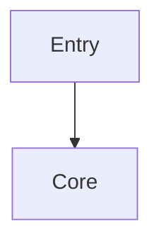

# Adoption System

Explain the adoption report pipeline: proposals, gates, metrics, and the composer sub-module.

## Analysis Focus (from plan)
Cover adoption-reports.js, adoption-proposals.js, adoption-gate.js, adoption-metrics.js, adoption-bundle.js, and the adoption-composer/ sub-module with its renderers.

## Grounding Notes (from knowledge plan)
- Amber Protocol is a repository-local governance layer for AI-assisted engineering, NOT a runtime framework or agent platform. It produces review artifacts, dry-run plans, and approval records as files inside the target repo.
- The CLI entry point is scripts/amber.js. All business logic lives in scripts/lib/. The scripts/lib/core/ directory is the core engine; files matching scripts/lib/*-commands.js are thin CLI wrappers that delegate to core functions.
- Seven governance control layers in priority order: Governance (highest) > Verification > Observability > Lifecycle > Context > Tooling > Execution (lowest/avoid). This priority weighting shapes the entire codebase.
- The delivery lifecycle is: audit -> init -> governance report -> next -> plan -> gate -> verify -> approve -> handoff bundle -> handoff validate. Each stage maps to a CLI command.
- Safety boundary: read-only/dry-run first. 'init' and 'wiki' never overwrite existing files. Amber does not auto-execute target-project commands, dispatch live agents, or run dynamic workflows.
- Skills in skills/*/SKILL.md are the single source of truth. Platform-specific files (.claude/, .agents/skills/, .gemini/commands/) are auto-generated via 'npm run gen:agents'. Never edit generated files; edit skills/ instead.
- Dependencies are intentionally minimal: ajv for JSON Schema validation, ajv-formats for format validation, nodemailer for notifications. No Express, no database, no ORM in the CLI package.
- src/ contains auxiliary utilities only (migration + security scanners), not the main CLI logic. Do not confuse src/ with scripts/lib/core/.
- apps/web/ is a standalone React 18 + Vite + tRPC + TanStack Router application with its own package.json (@amber-protocol/web). It is NOT part of the published amber-protocol npm package.
- Governed loop execution (ADR-0003) requires four gates: declarative policy check, explicit 'amber loop approve', isolated git worktree, and tamper-evident hash-chain ledger. Default 'loop run' is still dry-run.
- The project uses CommonJS ('type': 'commonjs' in package.json). Node >= 18.17 required.
- JSON Schemas in schemas/ define contracts for loop-contract, route, session-manifest, and timeline-event. All are validated with ajv at runtime.
- The project follows loop-engineering patterns. Continuous improvement is governed (see LOOP.md and amber-continuous-improvement skill).
- Stable knowledge lives under docs/wiki/ (and docs/architecture/). Current work state lives in feature_list.json, PROGRESS.md, session manifests, and ledgers.

## What system/approach is used

- 

## Key files / modules / packages

- 

## Architecture and conventions

- 

## Diagrams

*(Mermaid diagrams are supported in the generated knowledge; the original implementation had dedicated fix tooling.)*

## Rules developers should follow

- 

## Unknowns / Needs Confirmation

- 
