# CLI Architecture & Command Dispatch

Last Reviewed: 2026-08-18

Amber exposes one CommonJS CLI entry point and keeps command parsing, command routing,
and domain work in separate layers. The entry point validates the top-level command,
parses flags once, delegates to a registered handler, and owns result printing and the
process exit code. Handler modules translate CLI options into calls to reusable core
functions; durable behavior and artifact generation live under `scripts/lib/core/`.

## Key Files

- `scripts/amber.js` derives supported top-level commands from the Command definitions,
  parses arguments, calls `dispatch()`, prints text or JSON results, and returns non-zero
  when `result.errors` is non-empty.
- `scripts/lib/command-registry.js` owns each Command definition: identity, visibility
  tier, help knowledge, output policy, and handler binding. Typed seams and skill
  generation consume this same registry. `knownSubcommands()` derives family
  invocations from registered capabilities plus documented help verbs, while
  `commandInvocationContract()` projects command-specific allowed and required
  options from the Command help/usage definitions. `scripts/lib/command-help.js` is
  a compatibility re-export of that module.
- `scripts/lib/command-dispatcher.js` owns handler implementation, the bound runtime
  registry, family argument mapping, and deprecation warnings.
- `scripts/lib/*-commands.js` modules own command-specific option handling, target
  guards, and presentation-oriented result shaping.
- `scripts/lib/core/` contains reusable inspections, validators, report builders,
  lifecycle logic, governed execution, and artifact writers.
- `scripts/lib/core/cli-output.js` provides the shared argument and output boundaries
  used by the entry point.

## Dispatch Flow

1. `run()` handles help and version requests, projects `journey|core` by default (`--all` shows
   every tier), rejects unknown top-level commands, and
   parses the remaining arguments.
2. `dispatch(command, args)` looks up the command in the bound runtime registry; an unregistered
   command produces a structured error and exit code 1.
3. The selected wrapper delegates either to a command-family dispatcher or directly
   to a focused command module.
4. Command modules call core functions and return a result with `errors` and
   `warnings`. Async handlers are supported because `run()` awaits the dispatch result.
5. `scripts/amber.js` is the single output boundary unless a handler explicitly uses
   the `bypassPrint` contract for streaming or custom output.

```mermaid
flowchart LR
    Shell["node scripts/amber.js"] --> Entry["parse args and validate command"]
    Entry --> Definition["Command definitions: help + output policy"]
    Definition --> Registry["bound runtime registry"]
    Registry --> Family["family or *-commands adapter"]
    Family --> Core["scripts/lib/core domain logic"]
    Core --> Artifacts["repository artifacts and structured result"]
    Artifacts --> Output["text or JSON output and exit code"]
```

## Development Rules

- Add one top-level Command definition and bind its handler implementation; do not add
  another command list or a second CLI entry point.
- Keep wrappers focused on CLI concerns. Put reusable inspection, validation, state
  transition, and rendering logic in an appropriate core module.
- Preserve the structured result contract. Expected failures belong in `errors` or
  `warnings`, not in ad hoc process exits inside core functions.
- Route mutating commands through the existing policy, approval, isolation, and
  evidence controls. A new handler must not become an execution bypass.
- Keep read-only and dry-run behavior as the default, and retain idempotent,
  non-overwriting behavior for scaffold commands such as `init` and `wiki`.
- Authored skill frontmatter (`x-amber-json.command`) is checked at the existing
  generator seam against the registry and the CLI parser's flag specifications before
  products are planned. A stale family subcommand, invented top-level command,
  undocumented or missing option, malformed value, undeclared placeholder, or unused
  declared argument fails deterministically without executing the command or writing
  generated products.
- The root CLI package intentionally depends only on `ajv` and `ajv-formats`; Web
  dependencies remain isolated in `apps/web/package.json`.
 - `scripts/lib/cli-typed-seam.js` validates the Action whitelist at CLI startup and classifies
   Action-equivalent invocations through the same capability registry used by MCP. It does not
   replace CLI handlers or grant execution authority.
