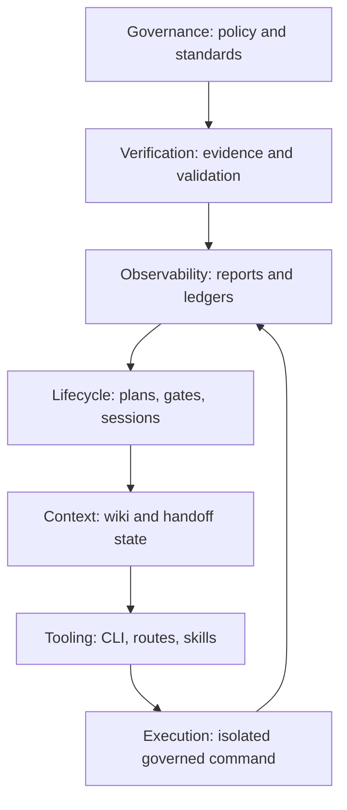

# Governance Model & Seven Layers

Last Reviewed: 2026-07-16

Amber orders controls from highest to lowest priority as Governance, Verification,
Observability, Lifecycle, Context, Tooling, and Execution. This is a decision rule,
not seven independent runtimes: lower layers may act only within the constraints and
evidence requirements established above them. The result is a repository-local
governance system whose primary outputs are inspectable files and decisions.

## Layer Map

| Layer | Purpose | Concrete surfaces |
| --- | --- | --- |
| Governance | Define allowed behavior and readiness criteria | `.amber/governance/rules.json`, `standards/amber-delivery.json`, `standards/owasp-agentic-2026.json`, `standards/security-governance.json` |
| Verification | Prove claims with executed checks and schema validation | evidence records, validators, `verify`, `complete-check --strict` |
| Observability | Make state and decisions inspectable | governance reports, readiness findings, session summaries, execution summaries, ledgers |
| Lifecycle | Order work and enforce checkpoints | `scripts/lib/core/lifecycle.js`, plans, gates, approvals, sessions |
| Context | Preserve stable knowledge and recovery state | `docs/wiki/`, handoff artifacts, session manifests, continuity surfaces |
| Tooling | Expose governed operations | CLI handlers, routes, skills, scaffold and maintenance commands |
| Execution | Run an approved command | `scripts/lib/core/governed-runner.js` inside an isolated worktree |

## Key Files

- `scripts/lib/core/governance.js` inspects policy and summarizes session and
  execution evidence for audit reporting.
- `scripts/lib/core/governance-readiness.js` inspects policy, governance docs,
  routes, workflow packs, security, audit evidence, and GLX controls. It returns a
  readiness decision, findings, errors, warnings, and structured next actions.
- `scripts/lib/core/governance-report.js` combines readiness and repository state
  into machine-readable data plus Markdown and text reports.
- `scripts/lib/governance-commands.js` is the CLI-facing dispatch boundary for the
  governance command family.
- `standards/*.json` stores versioned delivery and security control definitions used
  by governance checks and reports.

## Control Flow

The normal delivery sequence reflects the same ordering:
`audit -> init -> governance report -> next -> plan -> gate -> verify -> approve ->
handoff bundle -> handoff validate`. Readiness inspection identifies missing controls;
it does not silently repair them or claim that work was executed.

## Development Rules

- Treat policy and standards as constraints on every lower layer. Convenience at the
  tooling or execution layer cannot override a governance denial.
- Record the command, result, artifact or session identifier, and remaining risk for
  every completion, pass, or safety claim.
- Keep worker output, review, approval, and acceptance as separate records.
- Prefer inspections and dry-runs before mutation. A report or recommendation is not
  evidence that the recommended command ran.
- Add new readiness checks to the structured findings model so text, Markdown, and
  JSON consumers receive the same decision.
- Keep temporary status out of the wiki; store it in plans, manifests, ledgers, and
  handoff state while keeping the wiki for reviewed knowledge.
