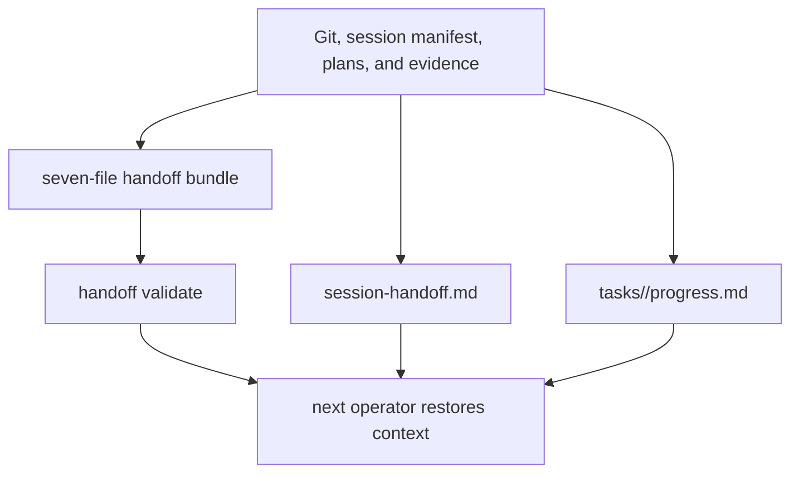

# Handoff & Continuity

Last Reviewed: 2026-07-16

Amber has three complementary continuity surfaces. A concise session handoff captures
the current working state, task progress files provide incremental recovery points,
and a portable handoff bundle packages verified continuation evidence. None of these
replaces source control or turns an unverified claim into completion evidence.

## Key Files and Artifacts

- `scripts/lib/handoff-command.js` gathers git and session evidence, renders the
  handoff template, and writes the repository's `session-handoff.md`.
- `templates/session-handoff.md` defines the concise handoff structure used when the
  target does not provide a more specific surface.
- `scripts/lib/continuity-surfaces.js` idempotently creates `MEMORY.md`, `notes.md`,
  and `tasks/README.md`, and appends entries to `tasks/<task-id>/progress.md` after
  validating the task identifier.
- `scripts/lib/core/handoff-bundle.js` writes and validates the portable bundle.
- A complete bundle contains `README.md`, `session-summary.md`,
  `verification-evidence.md`, `next-actions.md`, `risks.md`,
  `recovery-commands.md`, and `manifest.json`.
- `scripts/lib/session-commands.js` and `scripts/lib/session-manifest.js` implement the
  continuation flow and provide its structured session state.

## Flow

`handoff bundle` resolves target-relative paths, collects status and verification
evidence, records risks and recovery commands, and writes a manifest identifying the
artifact as an Amber handoff bundle. `handoff validate` checks required files and
bundle structure before the bundle is treated as transferable. Failed verification
details are bounded in rendered summaries, while the underlying evidence remains the
authoritative source.

## Development Rules

- Include the goal, work completed, current feature and session state, verification
  evidence, blockers, next action, and recovery commands in a handoff.
- Never describe dry-run, pending, or self-reported checks as executed evidence.
- Keep `REQUIRED_BUNDLE_FILES` synchronized with bundle writers, renderers, manifest
  validation, documentation, and tests.
- Use target-relative paths in portable artifacts and reject unsafe task identifiers
  before constructing a progress path.
- Preserve idempotent creation for continuity starter files; do not overwrite
  user-authored `MEMORY.md`, notes, or task indexes.
- Store durable reviewed knowledge in the wiki or `MEMORY.md`, temporary observations
  in `notes.md`, and task recovery state in per-task progress files.
- Validate the bundle before handoff completion is claimed and name any remaining
  failed verification or recovery risk.
