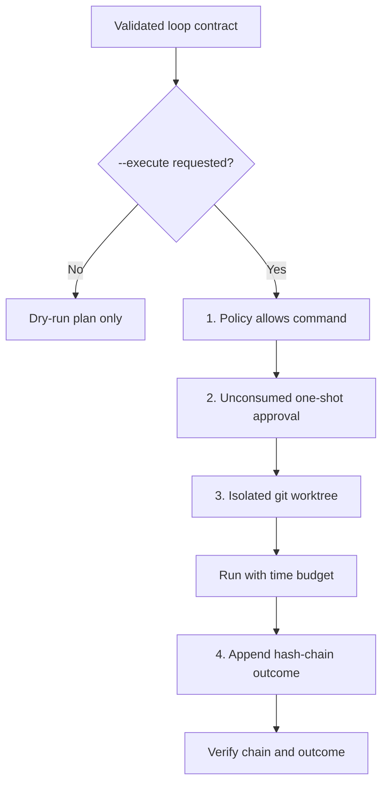

# Loop Engineering & Governed Execution

Last Reviewed: 2026-07-16

Loop contracts describe bounded improvement work, but do not schedule or execute it
by themselves. Inspection, recommendation, and `loop run` default to read-only or
dry-run behavior. Real command execution is an explicit alternate path protected by
policy, one-shot approval, worktree isolation, and a tamper-evident ledger.

## Key Files

- `schemas/loop-contract.schema.json` defines the declarative contract shape,
  including its state spine and hard stops.
- `scripts/lib/core/loops.js` finds, inspects, recommends, dry-runs, and records loop
  contracts and inspects their ledgers.
- `scripts/lib/core/execution-validator.js` validates loop contracts, workflow packs,
  integrations, and overall execution readiness.
- `scripts/lib/core/loop-policy.js` applies built-in destructive-command denials and
  project policy. Deny wins and the safe default is restrictive.
- `scripts/lib/core/loop-execution.js` creates one-shot approvals and orchestrates
  dry-run or governed execution.
- `scripts/lib/core/governed-runner.js` provides the reusable policy, approval,
  isolated worktree, execution budget, and ledger boundary.
- `scripts/lib/core/loop-ledger.js` canonicalizes and hashes records, appends the JSONL
  hash chain, finds unconsumed approvals, and verifies chain and outcome integrity.
- `.amber/autonomous-policy.json` records declarative autonomy bounds; it is not a
  scheduler and does not make a loop self-authorizing.

## Four Execution Gates

`loop approve` records a reviewer and a unique approval key in the contract ledger.
`loop run --execute` can consume only a valid unconsumed approval. The raw command is
reached only after policy and approval pass, and it runs in an isolated worktree. Every
policy denial and executed outcome is recorded in the ledger; missing approval,
repository, or worktree prerequisites return a structured error before execution.

## Development Rules

- Keep `loop run` dry-run by default. Never infer execution intent from a contract,
  recommendation, prior approval, or autonomous policy file.
- Apply built-in destructive-command denials before project allow rules. Custom policy
  must not be able to remove the baseline deny set.
- One approval authorizes one attempt. Do not reuse, synthesize, or self-issue an
  approval from worker output.
- Never run governed mutation in the main checkout.
- Append and verify ledger records through `loop-ledger.js`; do not hand-edit ledger
  JSONL or bypass canonical hashing.
- Preserve `execution: { executesAnything: false }` in declarative loop contracts.
  Contracts and recommendations describe work; the governed runner is the only
  execution boundary.
- Failure at any gate must stop before command execution and remain visible in the
  structured result and ledger evidence.
