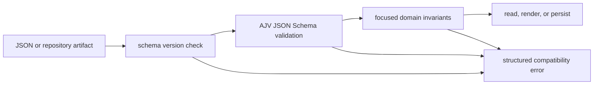

# Schema & Validation Layer

Last Reviewed: 2026-07-16

Amber uses versioned JSON Schema for durable artifact contracts and focused runtime
validators for repository-specific invariants. AJV is the root CLI's schema engine;
`ajv-formats` supplies format checks. Validation happens before state is used or
written, while schema-version checks produce explicit compatibility diagnostics. The
artifact schemas in the table below carry the optional protocol-versioning fields
(`amber_protocol_version`, `artifact_sequence`, `created_at`, `artifact_type`)
mandated by ADR-0012, and the shared AJV setup named in the development rules is the
schema-contract seam that F042 generalized (`scripts/lib/core/schema-contract.js`),
so no module instantiates Ajv directly.

## Authoritative Schemas

There are five contracts under `schemas/`:

| Schema | Required identity and purpose |
| --- | --- |
| `knowledge-plan.schema.json` | `schemaVersion` and `knowledgePlan`; generated knowledge plan inputs |
| `loop-contract.schema.json` | `id`, `trigger`, `stateSpine`, and `hardStops`; governed loop declaration |
| `route.schema.json` | `routeId`, `schemaVersion`, and `stages`; Route stages and gates |
| `session-manifest.schema.json` | session identity, route, goal, status, and creation time |
| `timeline-event.schema.json` | `timestamp` and `type`; append-only session event shape |

## Runtime Boundaries

- `scripts/lib/core/knowledge-plan.js` uses AJV to validate a knowledge plan before
  normalization or materialization.
- `scripts/lib/validate-route.js` compiles and applies the Route schema.
- `scripts/lib/session-manifest.js` validates session manifests before persistence.
- `scripts/lib/core/validators.js` provides domain checks for feature lists,
  continuous-improvement state, and wiki structure where JSON Schema alone is not the
  complete contract.
- `scripts/lib/schema-version-checker.js` compares declared schema versions with
  supported versions and reports missing, invalid, newer, and older forms explicitly.

## Development Rules

- Change a schema and every producer, consumer, fixture, migration, and test in the
  same feature. A schema file alone does not migrate existing artifacts.
- Keep required properties and `additionalProperties` policy intentional. Do not make
  malformed input pass by silently deleting unknown fields.
- Compile schemas through the shared AJV setup and return actionable paths and
  messages from validation failures.
- Use JSON Schema for durable cross-module shapes and focused code validators for
  semantic rules that depend on repository state.
- Increment or explicitly handle schema versions when compatibility changes. Reject a
  newer unsupported version rather than guessing its meaning.
- The Web package uses Zod at its tRPC boundary; that is separate from the root
  repository-artifact schemas and should not replace them.
