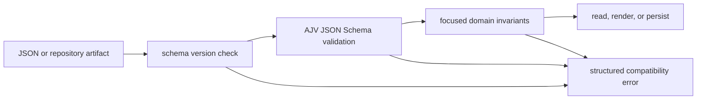

# Schema & Validation Layer

Last Reviewed: 2026-08-31

Amber uses versioned JSON Schema for durable artifact contracts and focused runtime
validators for repository-specific invariants. AJV is the root CLI's schema engine;
`ajv-formats` supplies format checks. Validation happens before state is used or
written, while schema-version checks produce explicit compatibility diagnostics. The
artifact schemas in the table below carry the optional protocol-versioning fields
(`amber_protocol_version`, `artifact_sequence`, `created_at`, `artifact_type`)
mandated by ADR-0012, and the shared AJV setup named in the development rules is the
schema-contract seam that F042 generalized (`scripts/lib/core/schema-contract.js`),
so no module instantiates Ajv directly.

## Authoritative Schemas

There are twenty contracts under `schemas/`. Five carry required-identity
documentation:

| Schema | Required identity and purpose |
| --- | --- |
| `knowledge-plan.schema.json` | `schemaVersion` and `knowledgePlan`; generated knowledge plan inputs |
| `loop-contract.schema.json` | `id`, `trigger`, `stateSpine`, and `hardStops`; governed loop declaration |
| `route.schema.json` | `routeId`, `schemaVersion`, and `stages`; Route stages and gates |
| `session-manifest.schema.json` | session identity, route, goal, status, and creation time |
| `timeline-event.schema.json` | `timestamp` and `type`; append-only session event shape |

The remaining fifteen contracts:

| Schema | Purpose |
| --- | --- |
| `action.type.schema.json` | Type-constrained, auditable governed operation (operational-ontology verb) an agent or human may submit |
| `context-benchmark.schema.json` | Context Loadout benchmark fixture: `fixtureId`, `fixtureRevision`, `mode` (`smoke`/`full`), `signal`, and `expected` outcome |
| `context-loadout.schema.json` | Deterministic, target-local bundle of required governance artifacts and selected Context Pages (ADR-0010, ADR-0015) |
| `context-page.schema.json` | Persisted unit of distilled project knowledge under `.amber/context/pages/`; every block cites its sources (ADR-0009) |
| `context-request.schema.json` | Distillation request Amber writes at `.amber/context/requests/<id>.json`; Amber judges the result, a host agent executes (ADR-0009) |
| `context-source-adapter.schema.json` | Context Source Adapter fixture: `adapterId` and its declared `sources` |
| `context-verification.schema.json` | Hash-bound evidence that a persisted Context Page passed the ingest gate |
| `knowledge-graph.schema.json` | Shape contract of the deterministic knowledge graph shared by the CLI and the web surface; version 2 admits Code Nodes and the imports/anchors verbs (F059, ADR-0025) |
| `memory-entry.schema.json` | Governed memory entry whose `entryId` is the content-hash identity — revised content is a new entry (Governed Memory Layer) |
| `memory-request.schema.json` | Memory nomination request at `.amber/memory/requests/<requestId>.json`; same family as `context-request` (Governed Memory Layer) |
| `projection.schema.json` | Rebuildable read-only projection manifest (Governance Graph, Governed Knowledge Base, Visualization Workbench); never canonical authority (ADR-0019) |
| `structural-identity.schema.json` | Ownership-bearing identity anchoring an artifact to its origin tenant, repository, and generation; carried inside every sync envelope (ADR-0019) |
| `sync-envelope.schema.json` | Versioned, immutable interchange contract wrapping exactly one governed artifact for transport across Amber instances (ADR-0019) |
| `sync-transport-report.schema.json` | Preparation-only report of structured proposed git operations for sync session push; closed verb set, no shell strings (ADR-0020) |
| `workflow-assessment.schema.json` | Read-only assessment of agent workflow effectiveness, separate from Governance Readiness (ADR-0008) |

## Runtime Boundaries

- `scripts/lib/core/knowledge-plan.js` uses AJV to validate a knowledge plan before
  normalization or materialization.
- `scripts/lib/validate-route.js` compiles and applies the Route schema.
- `scripts/lib/session-manifest.js` validates session manifests before persistence.
- `scripts/lib/core/validators.js` provides domain checks for feature lists,
  continuous-improvement state, and wiki structure where JSON Schema alone is not the
  complete contract.
- `scripts/lib/schema-version-checker.js` compares declared schema versions with
  supported versions and reports missing, invalid, newer, and older forms explicitly.

## Development Rules

- Change a schema and every producer, consumer, fixture, migration, and test in the
  same feature. A schema file alone does not migrate existing artifacts.
- Keep required properties and `additionalProperties` policy intentional. Do not make
  malformed input pass by silently deleting unknown fields.
- Compile schemas through the shared AJV setup and return actionable paths and
  messages from validation failures.
- Use JSON Schema for durable cross-module shapes and focused code validators for
  semantic rules that depend on repository state.
- Increment or explicitly handle schema versions when compatibility changes. Reject a
  newer unsupported version rather than guessing its meaning.
- The Web package uses Zod at its tRPC boundary; that is separate from the root
  repository-artifact schemas and should not replace them.
