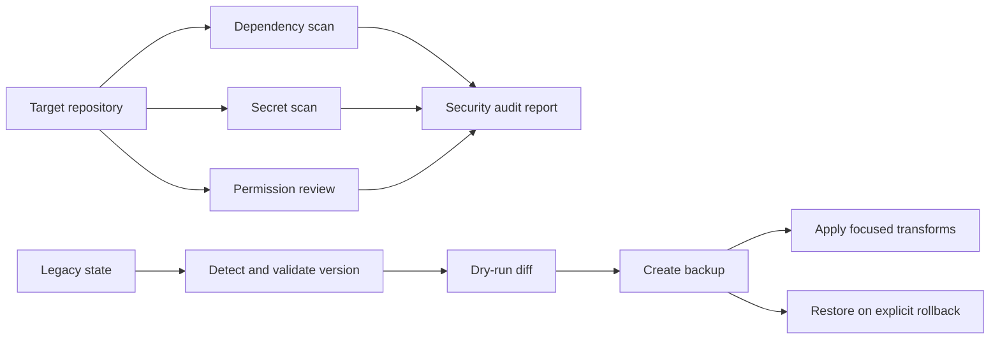

# Security & Migration Utilities

Last Reviewed: 2026-07-16

`src/security/` and `src/migration/` contain auxiliary utilities used by focused CLI
adapters and tests. They are not the main command or governance engine. Security tools
collect and render findings; migration tools validate, preview, back up, transform,
and restore legacy state with explicit boundaries.

## Security Utilities

- `src/security/dependency-scan.js` runs and parses `npm audit --json`, returning a
  normalized success flag, vulnerabilities, and scan errors.
- `src/security/secret-scan.js` walks candidate files, applies secret patterns and
  exclusions, and returns findings without rewriting source files.
- `src/security/permission-review.js` evaluates permission patterns and reports broad
  or risky access with explicit severities.
- `src/security/audit-report.js` combines dependency, secret, and permission results
  into a Markdown PASS/FAIL report grouped by severity with remediation guidance.
- `scripts/lib/security-commands.js` is the CLI-facing orchestrator for these scanners.

## Migration Utilities

- `src/migration/schema-validator.js` detects the source version and validates whether
  the requested upgrade path is supported.
- `src/migration/dry-run.js` deep-copies input, applies the pure settings transform to
  the copy, and reports added, removed, and modified fields without writing files.
- `src/migration/v5-to-phase-b.js` contains focused transforms for settings, agents,
  and routes.
- `src/migration/rollback.js` creates timestamped backups, discovers available backup
  files, and restores selected content.
- `scripts/lib/migrate-command.js` coordinates migration CLI options and result
  reporting.

## Development Rules

- Keep scans read-only. Findings and reports may recommend remediation, but scanners
  must not apply `npm audit fix`, rewrite secrets, or broaden permissions.
- Treat scanner errors separately from a clean scan; failure to inspect is not PASS.
- Redact sensitive values in findings and reports. A secret detector must identify the
  location without reproducing usable credentials.
- Run version validation and dry-run before migration, then create a backup before any
  write. Preserve rollback compatibility for every supported migration.
- Keep transforms deterministic and test them with representative legacy and already
  migrated inputs. A repeated migration should not corrupt current state.
- Restrict migration reads and writes to resolved target paths; reject unsafe backup
  or output paths.
- Route stable governance and lifecycle behavior through `scripts/lib/core/`; keep
  these `src/` modules focused on their auxiliary security and migration roles.
