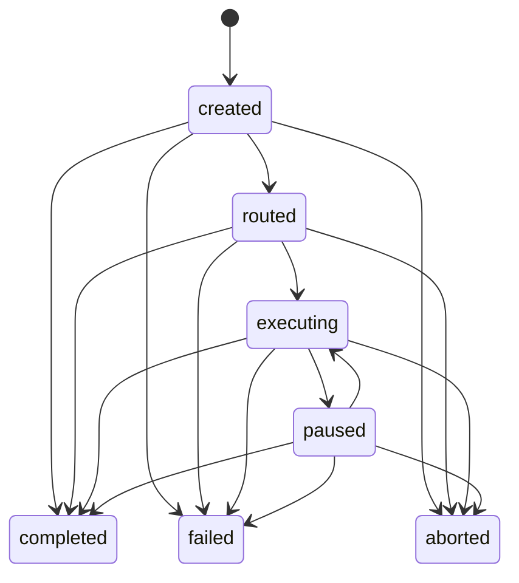

# Session & Lifecycle Management

Last Reviewed: 2026-07-16

A session is a durable execution context selected from a declarative Route. Its
manifest, event stream, checkpoints, verification evidence, and optional worktree make
the current state recoverable without relying on chat history. The lifecycle engine is
read-only guidance over repository state; session commands perform explicit legal
state transitions.

## Key Files

- `scripts/lib/session-commands.js` implements start, status, list, continue, verify,
  approve, complete, abort, and ledger verification operations.
- `scripts/lib/session-state-machine.js` defines the legal states and transitions.
- `scripts/lib/session-manifest.js` creates, validates, reads, and writes manifests
  using `schemas/session-manifest.schema.json`; writes stamp a monotonic `updatedAt`.
- `scripts/lib/route-loader.js` discovers and selects Route definitions;
  `scripts/lib/route-commands.js` exposes route inspection and execution operations.
- `scripts/lib/checkpoint-manager.js` stores and retrieves stage checkpoints inside a
  session's state directory.
- `scripts/lib/worktree-manager.js` creates and removes isolated git worktrees for
  session execution.
- `scripts/lib/core/lifecycle.js` gathers plans and repository signals, evaluates the
  standard lifecycle, and recommends the next governed step.

## State Model

The states are `created`, `routed`, `executing`, `paused`, `completed`, `failed`, and
`aborted`. `completed`, `failed`, and `aborted` are final. The normal path is
`created -> routed -> executing`, with `executing <-> paused`; active states may also
move to a final state where the transition table permits it.

## Runtime Flow

1. `session start` selects a Route from an explicit choice or goal matching, creates a
   manifest, records the initial events, and establishes the session directory.
2. Route stages define ordered work and gates. Continuing a session restores the
   latest checkpoint and advances only through a legal transition.
3. Mutating execution can use a session-specific worktree so the main checkout is not
   the execution environment.
4. Verification appends evidence rather than trusting self-reported completion.
   Approval and completion remain explicit operations.
5. `lifecycle` inspection reads plans, gates, and project signals to recommend a next
   action; it does not execute that action.

## Development Rules

- Add or change states only through the transition table and update manifest schema,
  renderers, recovery behavior, and tests together.
- Never mutate a final session. Start a new session or use the documented recovery
  path instead.
- Persist a checkpoint before a stage boundary that must be resumable, and append a
  timeline event for material state changes.
- Validate Route and manifest data before using it. Do not infer missing required
  fields at execution time.
- Keep route selection, state transition, checkpoint recovery, worktree isolation,
  verification, and approval as distinct responsibilities.
- A session status or dry-run is not proof of target-project execution; use recorded
  verification evidence for completion claims.
