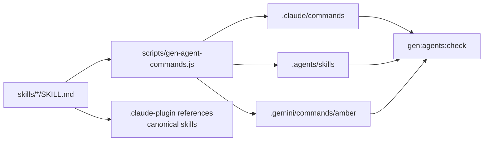

# Skills & Platform Generation

Last Reviewed: 2026-07-16

Amber maintains one canonical skill definition per capability and generates the
platform-specific surfaces from it. The ten directories under `skills/` are authored
inputs. Claude Code, Codex/Cursor, and Gemini files are products of the generator and
must remain reproducible from those inputs.

## Source and Outputs

- `skills/<name>/SKILL.md` is the source of truth for each Amber capability. Current
  skills cover adoption, audit, continuous improvement, doctor, handoff, init, plan,
  route, session, and wiki operations.
- `scripts/gen-agent-commands.js` is the CLI entry for generation and check mode; it
  delegates generation to the shared agent-command generator.
- `.claude-plugin/` exposes the canonical skills to Claude as a plugin, while generated
  command surfaces are written under `.claude/`.
- `.agents/skills/` is the generated open-standard skill location consumed by Codex
  and Cursor.
- `.gemini/commands/amber/` contains generated Gemini command definitions.
- `package.json` scripts `gen:agents` and `gen:agents:check` write products and detect
  drift respectively.

## Generation Flow

The generator interprets skill metadata and body content, then renders the format each
platform expects. Check mode computes the same products without accepting drift, which
makes the canonical skill and generated outputs a single tested contract.

## Development Rules

- Edit `skills/<name>/SKILL.md`, then run `npm run gen:agents`. Do not directly edit
  generated platform files.
- Run `npm run gen:agents:check` before completion and in CI to prove all mirrors match
  the canonical skills.
- Keep capability semantics in the canonical skill. Platform renderers may adapt
  syntax and metadata, but must not introduce a different workflow.
- Add a new Amber skill as a source directory first and update generator tests for all
  supported outputs in the same change.
- Treat generation as deterministic repository maintenance; generated output should
  not depend on machine-specific paths, clocks, or mutable external services.
- Skill instructions expose governed CLI behavior. They must not imply that Amber
  dispatches live agents or bypasses approvals on the user's behalf.
