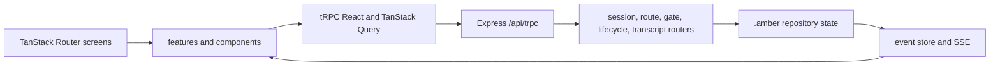

# Web Dashboard

Last Reviewed: 2026-07-16

`apps/web/` is a separate `@amber-protocol/web` package for inspecting and controlling
Amber repository state. It uses React 18 and TanStack Router in the browser, tRPC v10
and TanStack Query for typed request state, and an Express 5 server. It is not bundled
into the published root CLI package.

## Client Architecture

- `apps/web/src/router.tsx` creates the TanStack Router from the generated route tree.
- `apps/web/src/routes/` defines file-based screens for the dashboard, sessions,
  routes, transcripts, gates, and settings.
- `apps/web/src/lib/trpc.ts` creates the typed tRPC React client with SuperJSON and an
  HTTP batch link.
- `apps/web/src/lib/trpc-provider.tsx` owns the long-lived tRPC and QueryClient
  instances and installs both React providers.
- `apps/web/src/components/session/` and `apps/web/src/components/timeline/` render
  reusable session state and event views; `apps/web/src/features/` owns feature-level
  behavior.

## Server Architecture

- `apps/web/server/app.ts` mounts tRPC at `/api/trpc`, session event SSE at
  `/api/sessions/:sessionId/events`, error reports at `/api/errors`, and health at
  `/api/health`.
- `apps/web/server/app-router.ts` combines the session, session-control, route, gate,
  lifecycle, and transcript routers.
- `apps/web/server/routers/` validates procedure inputs with Zod and delegates access
  to focused services and adapters.
- `apps/web/server/routes/sse.ts` validates the SSE authentication token, replays
  historical events from the requested cursor, and streams subsequent session events.
- Server repository adapters read `.amber/` state only. Legacy `.harness` fallback is
  intentionally excluded by ADR-0006.

## Development Rules

- Keep Web dependencies and scripts in `apps/web/package.json`; do not add React,
  Express, tRPC, or Zod to the root CLI solely for dashboard work.
- Define shared request and response behavior in tRPC routers and consume the inferred
  `AppRouter` type on the client instead of duplicating API shapes.
- Validate all procedure inputs and SSE authentication before repository access.
- Preserve replay-before-stream behavior for timelines so reconnecting clients do not
  lose events.
- Read only `.amber/` state. Repositories requiring legacy migration must use the
  migration path rather than an invisible dashboard fallback.
- Keep the dashboard as a viewer and governed control surface; UI actions must call
  established command/service boundaries and must not bypass approval or evidence.
